# 🗺️ ATLAS — HYBRID-WISSENSRAUM

| Feld | Wert |
|---|---|
| Dateiname | `specs/ATLAS_HYBRID.md` |
| Version | `0.1.0` |
| Status | ENTWURF / ÄNDERUNGSANTRAG |
| System | MYRMEX v2.4.0 + Questor v0.2.3 + HAL v0.2.0 |
| Schicht | Layer 1 (`specs/`) — referenziert `foundation/` |
| Datum | 21. August 2026 |
| Konfliktregel | Bei Widersprüchen gilt: `CHARTER.md` > `CONTRACTS.md` > dieses Dokument |

---

## 0. Geltung und Änderungsregeln

Dieses Dokument beschreibt das Zielmodell eines einheitlichen Atlas-Systems.

Es kombiniert:

1. die Energie-/Evidenzbilanz aus dem Energie-Modell,
2. den semantischen Wissensgraphen aus dem Graphen-Modell,
3. die Topologie-, Varianz-, Diagnose- und Zugangsmuster aus dem Wissensraum-Modell,
4. eine zusätzliche Explorationsschicht für autonome Forschung.

Wichtig:

> Dieses Dokument definiert keine neuen Sicherheitsregeln.  
> Es darf keine bestehenden `CONTRACTS.md`-Verträge eigenmächtig ersetzen.  
> Alle neuen Datenverträge sind als Änderungsanträge an `CONTRACTS.md` zu behandeln.

Wenn dieses Modell bindend wird, müssen aktualisiert werden:

- `CONTRACTS.md`
- `GREMIUM.md`
- gegebenenfalls `VALIDATION.md`
- gegebenenfalls Szenario- und Testdokumente

---

## 1. Zweck des Atlas

Der Atlas ist die wissenschaftliche Landkarte des Systems.

Er dient nicht nur der Ablage von Wissen, sondern ermöglicht:

- wissenschaftliche Orientierung,
- Erkennung von Wissenslücken,
- Bewertung von Widersprüchen,
- Isolation instabiler Wissensbereiche,
- gezielte Diagnose,
- autonome Auswahl sinnvoller nächster Forschungsschritte.

Der Atlas soll insbesondere beantworten können:

| Frage | Atlas-Antwort |
|---|---|
| Was ist bekannt? | Kristalle, Knoten, Kanten, Zonen |
| Wie sicher ist etwas? | `support_confidence`, `evidence_mass`, `fracture_score` |
| Wo gibt es Widersprüche? | `CONTRADICTS`-Kanten, `conflict_energy`, hohe `fracture_score` |
| Wo ist es leer? | `UNEXPLORED`, geringe `evidence_mass` |
| Wo ist es sinnvoll leer? | `FrontierCandidate` |
| Wo darf geforscht werden? | Zone-Health, Quarantäne, LOCKED, Dimension-Freigaben |
| Was sollte als Nächstes getestet werden? | Frontier-Score, ResearchTopic, Wegmarken |

---

## 2. Designprinzipien

### 2.1 Oberste Prinzipien

| Prinzip | Bedeutung |
|---|---|
| Fail-Closed | Bei Unsicherheit keine Freigabe, keine Exploration, kontrollierter Abbruch oder Diagnose |
| Deterministic-First | LLM darf beraten, aber niemals final entscheiden |
| Operational ≠ Scientific | Operationale Fehler erzeugen keine wissenschaftlichen Signale |
| Questor schreibt nie in Atlas oder Archiv | Questor liefert nur Ergebnisse zurück |
| Blackboard-Pattern | Kommunikation über Atlas, Archiv und Pipeline, nicht über direkte Aufrufe |
| LLM ist nur Advisor | Keine sicherheitskritische oder finale Entscheidung durch LLM |
| Append-Only-Evidenz | Signal-Ledger werden nicht nachträglich gelöscht |
| Quellkonfidenz zählt | Signale werden mit `konfidenz` gewichtet |
| Zeitverfall | Alte Signale verlieren an Wirkung |
| Weiß ist neutral | ⬜ bestätigt und widerspricht nicht |
| Diagnose ist besonders | Diagnostische Signale destabilisieren nicht automatisch |
| Leere ist nicht gleich gesund | Eine Zone ohne Evidenz ist `UNEXPLORED`, nicht `HEALTHY` |

---

### 2.2 Spezielle Atlas-Prinzipien

| Prinzip | Bedeutung |
|---|---|
| Atlas als Wissensgraph | Hypothesen, Kristalle und Beziehungen werden als Knoten und Kanten dargestellt |
| Atlas als Energiebilanz | Signale erzeugen Support- und Conflict-Energie |
| Atlas als topologischer Raum | Wissen liegt in Dimensionen, Zonen und Clustern |
| Atlas als Zustandsmaschine | Zonen haben Health-, Quarantäne- und Lock-Zustände |
| Atlas als Explorationskarte | FrontierCandidates zeigen sinnvolle nächste Ziele |
| Atlas als Agentenkarte | Agenten erhalten strukturierte, maschinenlesbare Empfehlungen |

---

## 3. Gesamtaufbau des Atlas

Der Atlas besteht aus fünf Ebenen:

```text
ATLAS
│
├── 1. TOPOLOGIE
│   ├── Dimensionen
│   ├── Zonen
│   ├── Cluster
│   ├── Knoten
│   └── Kanten
│
├── 2. DYNAMIK
│   ├── SignalEvent
│   ├── Effektive Signalwirkung
│   ├── Support-/Conflict-Energie
│   ├── Kristallisationsfortschritt
│   └── Zeitverfall
│
├── 3. INTEGRITÄT
│   ├── fracture_score
│   ├── uncertainty_score
│   ├── zone_state
│   ├── quarantine_mode
│   ├── locked
│   └── full_rebuild_required
│
├── 4. ZUGANG
│   ├── Query-API
│   ├── Zugriffsmatrix
│   ├── Gremium-Rollen
│   └── Audit-Events
│
└── 5. EXPLORATION
    ├── FrontierEngine
    ├── FrontierCandidates
    ├── ResearchTopics
    └── Next-Best-Action-Empfehlungen
```

---

## 4. Gesamtes Systemdiagramm

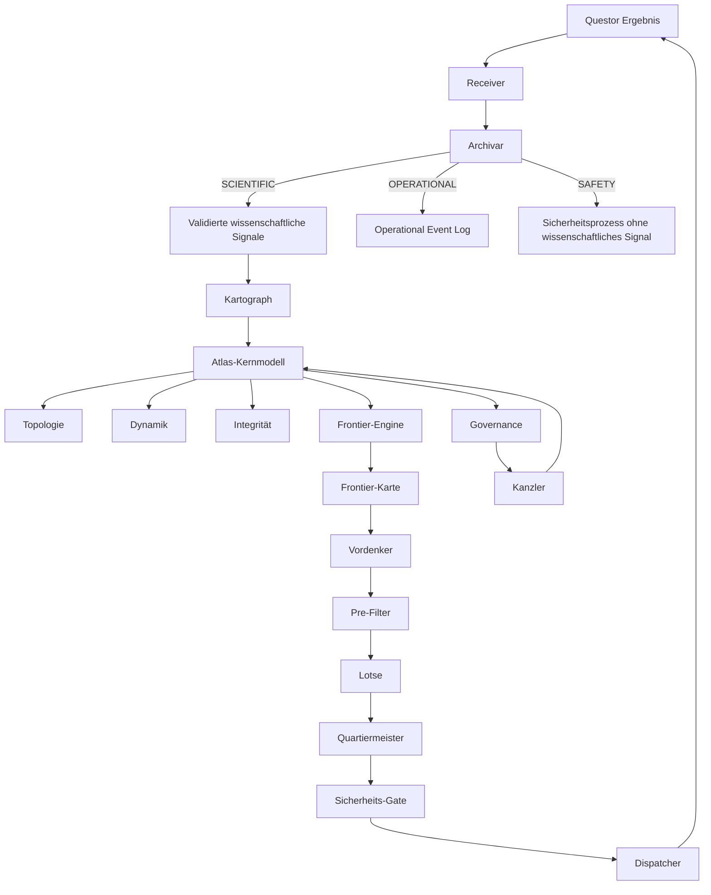

---

## 5. Topologie

Die Topologie beschreibt die Struktur des Wissensraums.

---

### 5.1 Dimensionen

Dimensionen sind die Achsen des wissenschaftlichen Raums.

Beispiele:

- Temperatur
- pH-Wert
- Konzentration
- Zeit
- Druck
- Lernrate
- Frequenz
- Materialklasse

Jede Dimension braucht eine Freigabe.

Neue Dimensionen dürfen nicht eigenmächtig erforscht werden.

---

### 5.2 DimensionDefinition

```python
class DimensionDefinition:
    dimension_id: str
    display_name: str
    domain: str
    value_type: CONTINUOUS | DISCRETE | CATEGORICAL
    unit: Optional[str]
    value_range: Optional[tuple[float, float]]
    parent_dimension: Optional[str]
    approved: bool
    onboarding_request_ref: Optional[str]
    approved_by: Optional[str]
    approved_at: Optional[str]
    created_at: str
    updated_at: str
```

---

### 5.3 Zonen

Eine Zone ist eine Region im Dimensionsraum.

Eine Zone kann enthalten:

- Knoten,
- Kristalle,
- Hypothesen,
- Signal-Ledger,
- Energiekonten,
- Diagnose-Budget,
- Governance-Einträge,
- Frontier-Metadaten.

Zonen können hierarchisch organisiert sein:

```text
chemie
└── kinetik
    ├── temperatur-niedrig
    ├── temperatur-mittel
    └── temperatur-hoch
```

---

### 5.4 AtlasZone

```python
class AtlasZone:
    zone_id: str
    parent_zone_id: Optional[str]
    dimension_refs: list[str]
    center_coordinates: dict[str, float]
    radius: dict[str, float]

    # Evidenzkonten
    signal_ledger: list[SignalEvent]
    support_energy: float
    conflict_energy: float
    diagnostic_energy: float
    policy_energy: float
    evidence_mass: float

    # Scores
    fracture_score: float
    support_confidence: float
    uncertainty_score: float
    crystallization_progress: float

    # Zustand
    zone_state: UNEXPLORED | HEALTHY | DEGRADED | CRITICAL | LOCKED
    quarantine_mode: bool
    full_rebuild_required: bool
    locked: bool
    locked_by: Optional[str]
    locked_reason: Optional[str]

    # Diagnostik
    diagnosis_budget: int
    diagnostic_evidence: list[str]

    # Inhalt
    node_ids: list[str]
    crystal_ids: list[str]
    cluster_id: Optional[str]

    # Governance
    blocked_ideas: list[str]

    # Version
    atlas_version: str
    created_at: str
    last_modified: str
    modification_count: int
```

---

### 5.5 Knoten

Knoten sind wissenschaftliche Objekte im Atlas.

Mögliche Knotentypen:

| Knotentyp | Bedeutung |
|---|---|
| `HYPOTHESIS` | Eine testbare Vorhersage |
| `CRYSTAL` | Ein bestätigter Wissenspunkt |
| `FRONTIER_ANCHOR` | Ein Anker für eine Frontier |
| `ZONE_ANCHOR` | Ein Zentrum oder Referenzpunkt einer Zone |
| `DIMENSION_REF` | Eine Dimensionsreferenz |

---

### 5.6 AtlasNode

```python
class AtlasNode:
    node_id: str
    node_type: HYPOTHESIS | CRYSTAL | FRONTIER_ANCHOR | ZONE_ANCHOR | DIMENSION_REF
    zone_ref: str
    position: dict[str, float]

    # Evidenz
    support_energy: float
    conflict_energy: float
    evidence_mass: float

    # Scores
    support_confidence: float
    fracture_score: float
    uncertainty_score: float
    crystallization_progress: float

    # Kristallisation
    crystallized: bool
    crystallized_at: Optional[str]
    ist_diagnostic: bool
    cluster_integration: bool

    # Beziehungen
    edge_ids: list[str]

    # Herkunft
    source_package_ids: list[str]
    topic_refs: list[str]
    created_at: str
    updated_at: str
```

---

### 5.7 Kanten

Kanten beschreiben wissenschaftliche Beziehungen.

| Kante | Bedeutung |
|---|---|
| `SUPPORTS` | A stützt B |
| `CONTRADICTS` | A widerspricht B |
| `EXTENDS` | A erweitert B |
| `DEPENDS_ON` | A hängt von B ab |
| `DERIVED_FROM` | A wurde aus B abgeleitet |
| `LOCATED_IN` | A liegt in Zone B |
| `MEASURES` | A misst Dimension B |
| `DIAGNOSTIC_FOR` | A dient der Diagnose von B |
| `BLOCKED_BY` | A ist durch Governance blockiert |
| `NEAR_FRONTIER` | A liegt in der Nähe einer Frontier |

---

### 5.8 AtlasEdge

```python
class AtlasEdge:
    edge_id: str
    source_node_id: str
    target_node_id: str
    edge_type: SUPPORTS | CONTRADICTS | EXTENDS | DEPENDS_ON | DERIVED_FROM | LOCATED_IN | MEASURES | DIAGNOSTIC_FOR | BLOCKED_BY | NEAR_FRONTIER
    weight: float
    evidence_refs: list[str]
    created_at: str
    updated_at: str
```

---

### 5.9 Cluster

Cluster gruppieren thematisch verwandte Zonen oder Knoten.

Regeln:

- Cluster werden deterministisch berechnet, zum Beispiel DBSCAN.
- Diagnostic-Kristalle mit `cluster_integration = false` fließen nicht in normale Cluster ein.
- Cluster können Verbindungen zueinander haben.
- Fehlende Verbindungen zwischen Clustern können FrontierCandidates erzeugen.

---

## 6. Topologie-Knotendiagramm

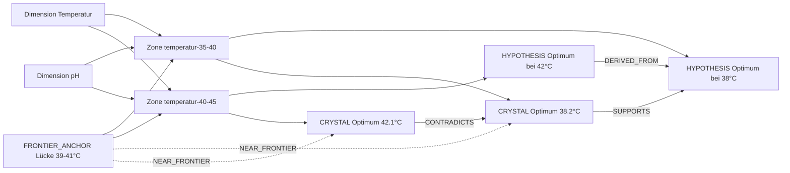

---

## 7. Dynamik

Die Dynamik beschreibt, wie Signale den Atlas verändern.

---

### 7.1 SignalEvent

Der bestehende Vertrag in `CONTRACTS.md §5.6` enthält bereits:

```python
class SignalEvent:
    signal_typ: str
    zone_ref: str
    timestamp: str
    source_package_id: str
    konfidenz: float
```

Für das Hybridmodell werden folgende Ergänzungen als Änderungsantrag vorgeschlagen:

```python
class SignalEvent:
    signal_typ: str                          # 🟥 🟨 🟪 🟩 ⬜
    zone_ref: str
    node_ref: Optional[str]
    timestamp: str
    cycle_created: int
    source_package_id: str
    source_component: str
    konfidenz: float

    # Neue Felder
    is_diagnostic: bool
    is_policy: bool
    base_support_weight: float
    base_conflict_weight: float
    base_diagnostic_weight: float
    effective_support_weight: float
    effective_conflict_weight: float
    effective_diagnostic_weight: float
    ttl_cycles: int
    evidence_refs: list[str]
```

---

### 7.2 Signalgewichte

Die Signalgewichte sind konfigurierbar.

Empfohlene Defaults:

| Signal | Bedeutung | Support-Gewicht | Conflict-Gewicht | Diagnostic-Gewicht | Policy-Gewicht |
|---|---|---:|---:|---:|---:|
| 🟩 GRÜN | Bestätigung | `0.50` | `0.0` | `0.0` | `0.0` |
| ⬜ WEISS | Neutral | `0.0` | `0.0` | `0.0` | `0.0` |
| 🟨 GELB | Widerspruch | `0.0` | `0.60` | `0.0` | `0.0` |
| 🟥 ROT | Kritischer Fehler | `0.0` | `1.00` | `0.0` | `0.0` |
| 🟪 PURPUR_DIAGNOSTIC | Diagnose | `0.0` | `0.0` | `0.30` | `0.0` |
| 🟪 PURPUR_POLICY | Policy-Veto / Blockade | `0.0` | `0.0` | `0.0` | `0.30` |

Wichtige Regeln:

- ⬜ WEISS ist neutral.
- 🟪 PURPUR_DIAGNOSTIC erhöht nicht automatisch die wissenschaftliche Fracture.
- 🟪 PURPUR_POLICY ist Governance, nicht automatisch wissenschaftlicher Widerspruch.
- 🟥 ROT darf nicht durch eine LLM-Komponente geschrieben werden.
- 🟥 ROT entsteht nur deterministisch oder nach Sicherheitsprüfung.

---

### 7.3 Effektive Signalwirkung

Jedes Signal wird mit Konfidenz und Zeitverfall gewichtet:

```text
effective_weight =
    base_weight
    × konfidenz
    × decay(age_cycles)
```

mit:

```text
decay(age_cycles) = exp(-signal_decay_lambda × age_cycles)
```

Empfohlene Default-Werte:

```text
signal_decay_lambda = 0.08
signal_ttl_cycles = 50
```

Nach `ttl_cycles` wird das Signal für aktive Berechnungen irrelevant, bleibt aber im append-only Ledger erhalten.

---

### 7.4 Energiekonten

Für jeden Knoten und jede Zone werden getrennte Energiekonten geführt:

```text
support_energy =
    Summe aller effektiven Support-Gewichte

conflict_energy =
    Summe aller effektiven Conflict-Gewichte

diagnostic_energy =
    Summe aller effektiven Diagnostic-Gewichte

policy_energy =
    Summe aller effektiven Policy-Gewichte

evidence_mass =
    support_energy + conflict_energy
```

Wichtig:

> `diagnostic_energy` und `policy_energy` verändern nicht automatisch die wissenschaftliche `fracture_score`.

Sie beeinflussen:

- Diagnose-Budget,
- Governance-Status,
- Unsicherheitsbewertung,
- Frontier-Bewertung,
- Blockaden.

---

## 8. Signalverarbeitung

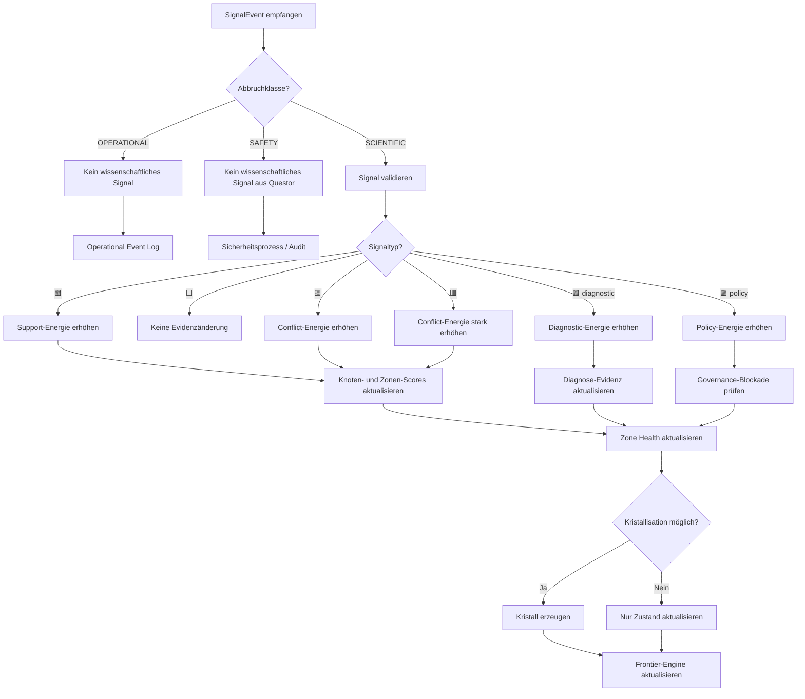

---

## 9. Integrität

Die Integritätsschicht bewertet die Gesundheit des Wissens.

---

### 9.1 Fracture-Score

```text
fracture_score =
    conflict_energy
    /
    (support_energy + conflict_energy + ε)
```

mit:

```text
ε = 0.001
```

Interpretation:

| fracture_score | Bedeutung |
|---:|---|
| `0.00` | Keine erkennbaren Widersprüche |
| `0.30` | Erste relevante Widersprüche |
| `0.60` | Starke Widersprüche, Quarantäne-Modus |
| `0.85` | Kritische Instabilität, FULL_REBUILD prüfen |

---

### 9.2 Support-Confidence

```text
support_confidence =
    support_energy
    /
    (support_energy + K_conf)
```

Empfohlener Default:

```text
K_conf = 1.0
```

Interpretation:

| support_confidence | Bedeutung |
|---:|---|
| niedrig | wenig bestätigende Evidenz |
| mittel | teilweise bestätigt |
| hoch | stark bestätigt |

---

### 9.3 Uncertainty-Score

Der Uncertainty-Score kombiniert fehlende Evidenz und Signalstreuung.

Grundform:

```text
evidence_scarcity =
    exp(-evidence_mass / K_evidence)

variance_factor =
    normalized_weighted_signal_variance

uncertainty_score =
    evidence_scarcity × (0.5 + 0.5 × variance_factor)
```

Sonderregel:

```text
Wenn evidence_mass == 0:
    uncertainty_score = 1.0
```

Empfohlener Default:

```text
K_evidence = 2.0
```

Verwendung:

- Frontier-Erkennung,
- Diagnose-Kandidaten,
- Themen mit hohem Informationsgewinn,
- Visualisierung von Unsicherheit.

---

### 9.4 Zone-Health

Zonen haben einen Zustand und zusätzliche Modi.

```python
zone_state: UNEXPLORED | HEALTHY | DEGRADED | CRITICAL | LOCKED
quarantine_mode: bool
full_rebuild_required: bool
locked: bool
```

---

### 9.5 Empfohlene Zustandsregeln

```text
Wenn locked == true:
    zone_state = LOCKED
    keine normale Exploration
    nur Audit, Diagnose oder Kanzler-Aktionen

Wenn evidence_mass < min_evidence_mass:
    zone_state = UNEXPLORED

Wenn fracture_score >= full_rebuild_threshold:
    zone_state = CRITICAL
    full_rebuild_required = true
    quarantine_mode = true

Wenn fracture_score >= quarantine_threshold:
    quarantine_mode = true
    wenn zone_state nicht CRITICAL:
        zone_state = DEGRADED

Wenn fracture_score >= degraded_threshold:
    zone_state = DEGRADED

Wenn fracture_score < degraded_threshold
und support_confidence >= healthy_confidence:
    zone_state = HEALTHY

Sonst:
    zone_state = UNEXPLORED
```

---

### 9.6 Empfohlene Schwellwerte

| Parameter | Default | Bedeutung |
|---|---:|---|
| `min_evidence_mass` | `0.20` | Unterhalb: Zone ist `UNEXPLORED` |
| `degraded_threshold` | `0.30` | Ab hier: `DEGRADED` |
| `quarantine_threshold` | `0.60` | Ab hier: Quarantäne-Modus |
| `full_rebuild_threshold` | `0.85` | Ab hier: FULL_REBUILD prüfen |
| `healthy_confidence` | `0.70` | Nötig für `HEALTHY` |

---

## 10. Zustandsdiagramm einer Zone

```mermaid
stateDiagram-v2
    [*] --> UNEXPLORED

    UNEXPLORED --> HEALTHY: evidence_mass >= min\nfracture < 0.30\nsupport_confidence >= 0.70
    UNEXPLORED --> DEGRADED: evidence_mass >= min\nfracture >= 0.30

    HEALTHY --> DEGRADED: fracture >= 0.30
    DEGRADED --> QUARANTINE_MODE: fracture >= 0.60
    QUARANTINE_MODE --> CRITICAL: fracture >= 0.85

    DEGRADED --> HEALTHY: fracture < 0.30\nsupport_confidence >= 0.70
    QUARANTINE_MODE --> DEGRADED: erfolgreiche Diagnose\nfracture < 0.60
    CRITICAL --> FULL_REBUILD: full_rebuild_required
    FULL_REBUILD --> UNEXPLORED: atomarer Neuaufbau

    HEALTHY --> LOCKED: manuelle Sperre
    UNEXPLORED --> LOCKED: manuelle Sperre
    DEGRADED --> LOCKED: manuelle Sperre
    LOCKED --> UNEXPLORED: manuelle Freigabe / Review
```

Hinweis:

`QUARANTINE_MODE` ist hier als Modus dargestellt, nicht als exklusiver Endzustand.

---

## 11. Kristallisation

Kristallisation ist der Übergang von einer Hypothese zu einem Kristall.

---

### 11.1 Kristallisationsfortschritt

```text
crystallization_progress =
    support_energy
    /
    crystallization_threshold
```

Empfohlener Default:

```text
crystallization_threshold = 1.0
```

---

### 11.2 Kristallisationsbedingungen

Ein Knoten darf kristallisieren, wenn alle folgenden Bedingungen erfüllt sind:

```text
1. node_type == HYPOTHESIS

2. crystallization_progress >= 1.0

3. min_confirmations >= 3
   → mindestens drei relevante 🟩-Signale

4. fracture_score < max_fracture_for_crystallization
   → Default: 0.30

5. Kein starkes 🟨- oder 🟥-Signal innerhalb der interrupt_window
   → Default: letzte 5 Signale

6. zone_state != LOCKED

7. quarantine_mode == false
   oder explizit freigegebene Diagnostik

8. Keine aktive Policy-Blockade für diesen Knoten
```

---

### 11.3 Kristallisationsdiagramm

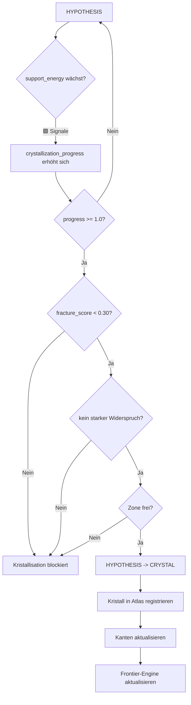

---

### 11.4 Widerspruch gegen einen Kristall

Wenn ein 🟨- oder 🟥-Signal einen Kristall betrifft:

1. Der Kristall wird nicht sofort gelöscht.
2. Eine `CONTRADICTS`-Kante wird erzeugt.
3. `conflict_energy` steigt.
4. `fracture_score` kann steigen.
5. Die Zone kann `DEGRADED`, `QUARANTINE_MODE` oder `CRITICAL` werden.
6. Die Frontier-Engine kann eine `CONTRADICTION_GAP` oder `DIAGNOSTIC_FRONTIER` erzeugen.

---

## 12. Diagnose und Quarantäne

---

### 12.1 Quarantäne-Modus

Der Quarantäne-Modus wird automatisch aktiviert, wenn:

```text
fracture_score >= quarantine_threshold
```

oder wenn eine manuelle Sicherheitsentscheidung dies verlangt.

Im Quarantäne-Modus gilt:

```text
Normale Exploration: verboten
Normale Optimierung: verboten
VALIDATE: nur eingeschränkt nach Freigabe
DIAGNOSE: erlaubt, wenn Diagnose-Budget vorhanden ist
```

---

### 12.2 Diagnose-Budget

```python
diagnosis_budget: int
```

Empfohlener Default:

```text
diagnosis_budget = 3
```

Regeln:

- Bei Eintritt in Quarantäne wird das Budget gesetzt.
- Jede diagnostische Wegmarke kostet Budget.
- Bei `diagnosis_budget == 0` ist keine weitere Diagnose erlaubt.
- Danach ist Eskalation oder manuelle Intervention erforderlich.

---

### 12.3 DiagnosticWaypoint

```python
class DiagnosticWaypoint:
    waypoint_id: str
    source_idee: str
    zone_ref: str
    koordinaten: dict[str, float]
    intent: DIAGNOSE
    required_gate_mode: FRACTURE_DIAGNOSIS
    budget_cost: int
    atlas_version_ref: str
    created_at: str
    status: PLATZIERT | AUSGEFÜHRT | VERWORFEN
```

Regel:

> Ein DiagnosticWaypoint erzeugt immer `required_gate_mode = FRACTURE_DIAGNOSIS`.

Das passt zu `QUESTOR.md`:

> Bei `gate_mode == FRACTURE_DIAGNOSIS` wird `autonomy_level = STRICT` erzwungen.

---

## 13. Governance

Governance schützt den Atlas vor unsicheren, unerlaubten oder blockierten Aktionen.

---

### 13.1 Governance-Objekte

```python
class BlockedIdea:
    idee_id: str
    zone_ref: str
    block_grund: str
    policy_veto_id: Optional[str]
    appeal_id: Optional[str]
    blocked_at: str
    review_after_cycles: int
    review_status: PENDING | REVIEWED | AUFGEHOBEN | ESKALIERT
```

```python
class PolicyVetoRecord:
    policy_veto_id: str
    gate_id: str
    package_id: str
    zyklus_id: str
    veto_grund: str
    evidence_refs: list[str]
    policy_ref: Optional[str]
    review_zyklus_counter: int
    review_interval: int
    review_status: AUSSTEHEND | BESTÄTIGT | AUFGEHOBEN | ESKALIERT
    created_at: str
    last_review_timestamp: Optional[str]
```

```python
class AppealRecord:
    appeal_id: str
    gate_id: str
    package_id: str
    zyklus_id: str
    richter_result: PASS | FAIL
    seher_result: PASS | VETO | TEMP_SUSPENDED
    veto_details: Optional[VetoDetails]
    kanzler_decision: Optional[KanzlerDecision]
    appeal_status: PENDING | GRANTED | DENIED
    policy_veto_id: Optional[str]
    created_at: str
    decided_at: Optional[str]
```

```python
class DimensionOnboardingRequest:
    request_id: str
    dimension_name: str
    dimension_typ: CONTINUOUS | DISCRETE | CATEGORICAL
    einheit: Optional[str]
    status: PENDING | APPROVED | REJECTED
    angefragt_von: str
    timestamp: str
    approved_by: Optional[str]
    approved_at: Optional[str]
```

---

### 13.2 LOCKED

`LOCKED` ist eine manuelle oder sicherheitsrelevante Sperre.

Regeln:

```text
LOCKED überschreibt alle anderen Zustände.
LOCKED verbietet normale Exploration.
LOCKED erfordert Audit.
LOCKED darf nur durch Kanzler, Königin oder einen autorisierten Sicherheitsprozess aufgelöst werden.
```

---

## 14. Frontier-Engine

Die Frontier-Engine ist die zentrale Ergänzung für autonome Forschung.

Sie findet nicht einfach leere Stellen, sondern **sinnvolle** leere Stellen.

---

### 14.1 Zweck

Die Frontier-Engine beantwortet:

```text
Wo ist es leer?
Wo ist es unsicher?
Wo ist ein Widerspruch?
Wo ist eine Brücke zwischen Clustern?
Wo ist eine Diagnose nötig?
Wo ist Forschung sicher, billig und vielversprechend?
```

---

### 14.2 Frontier-Typen

| Frontier-Typ | Bedeutung |
|---|---|
| `WEISSRAUM` | Region ohne Evidenz, aber mit Anschluss |
| `CONTRADICTION_GAP` | Lücke zwischen widersprüchlichen Kristallen |
| `BRIDGE_FRONTIER` | Fehlende Verbindung zwischen Clustern |
| `DIAGNOSTIC_FRONTIER` | Zone mit Quarantäne oder hoher Unsicherheit |
| `LOW_COST_FRONTIER` | Wissenschaftlich interessante, günstige Region |
| `DEEP_UNCERTAIN` | Region mit hoher Varianz und niedriger Evidenz |

---

### 14.3 FrontierCandidate

```python
class FrontierCandidate:
    candidate_id: str
    frontier_type: WEISSRAUM | CONTRADICTION_GAP | BRIDGE_FRONTIER | DIAGNOSTIC_FRONTIER | LOW_COST_FRONTIER | DEEP_UNCERTAIN
    zone_id: str
    coordinates: dict[str, float]
    topic_refs: list[str]

    # Scores
    frontier_score: float
    novelty_score: float
    promise_score: float
    information_gain_score: float
    connectivity_score: float
    cluster_relevance_score: float
    uncertainty_score: float
    estimated_cost: float
    risk_score: float

    # Sicherheit
    safety_status: CLEAR | RESTRICTED | BLOCKED
    quarantine_mode: bool
    locked: bool

    # Empfehlung
    suggested_objective_type: EXPLORE | VALIDATE | DIAGNOSE | OPTIMIZE | CLARIFY
    suggested_gate_mode: NORMAL | FRACTURE_DIAGNOSIS | SANDBOX
    required_capabilities: list[str]
    reason: str
    evidence_refs: list[str]

    created_at: str
    expires_at: Optional[str]
```

---

### 14.4 Harte Filter

Bevor ein FrontierCandidate bewertet wird, gelten harte Filter:

```text
Ausschluss, wenn:

- zone_state == LOCKED
- quarantine_mode == true und kein DIAGNOSE-Budget vorhanden ist
- Dimension nicht freigegeben ist
- keine passende Capability vorhanden ist
- keine gültige Lease-/Routing-Option existiert
- Sicherheitsblockade aktiv ist
- Policy-Veto aktiv ist
- geschätztes Budget nicht verfügbar ist
```

Diese Filter sind fail-closed.

---

### 14.5 Frontier-Score

Empfohlene Form:

```text
frontier_score =
    safety_factor
    ×
    (
        w_novelty × novelty_score
      + w_promise × promise_score
      + w_information_gain × information_gain_score
      + w_connectivity × connectivity_score
      + w_cluster_relevance × cluster_relevance_score
    )
    - w_cost × estimated_cost
    - w_risk × risk_score
```

Ergebnis wird begrenzt:

```text
frontier_score = clamp(0.0, 1.0, frontier_score)
```

---

### 14.6 Empfohlene Frontier-Gewichte

| Parameter | Default |
|---|---:|
| `w_novelty` | `0.20` |
| `w_promise` | `0.25` |
| `w_information_gain` | `0.20` |
| `w_connectivity` | `0.10` |
| `w_cluster_relevance` | `0.10` |
| `w_cost` | `0.10` |
| `w_risk` | `0.05` |

`safety_factor`:

```text
BLOCKED = 0.0
RESTRICTED = 0.5
CLEAR = 1.0
```

---

### 14.7 Bedeutung der Score-Komponenten

#### novelty_score

```text
Wie unbekannt ist die Region?
```

Basis:

```text
evidence_mass
```

Je niedriger die `evidence_mass`, desto höher die Novelty.

---

#### promise_score

```text
Wie wahrscheinlich ist ein wissenschaftlich wertvoller Fund?
```

Basis:

- Nähe zu grünen Kristallen,
- Nähe zu erfolgreichen Zonen,
- thematische Cluster-Nähe,
- bekannte positive Gradienten,
- vorhandene Hypothesen.

---

#### information_gain_score

```text
Wie stark würde ein Ergebnis den Atlas verbessern?
```

Basis:

- `uncertainty_score`,
- Nähe zu Widersprüchen,
- fehlende Brücken zwischen Clustern,
- offene Hypothesen,
- diagnostische Relevanz.

---

#### connectivity_score

```text
Wie gut ist die Stelle erreichbar?
```

Basis:

- Routing-Graph,
- Capabilities,
- Slots,
- Leases,
- Zone-Locks,
- geschätzte Wartezeit.

---

#### cluster_relevance_score

```text
Wie wichtig ist die Stelle für bestehende Themen oder Cluster?
```

Basis:

- Nähe zu aktiven Clustern,
- Zugehörigkeit zu ResearchTopics,
- strategische Priorität.

---

#### estimated_cost

```text
Geschätzte Kosten der Exploration.
```

Basis:

- Zeit,
- Reagenzien,
- Compute,
- Energie,
- Slot-Bedarf.

---

#### risk_score

```text
Geschätztes Risiko.
```

Basis:

- Nähe zu roten Signalen,
- Safety-Vorgeschichte,
- Policy-Vetos,
- gefährliche Dimensionen,
- bisherige Fehlschläge.

---

## 15. Frontier-Engine-Diagramm

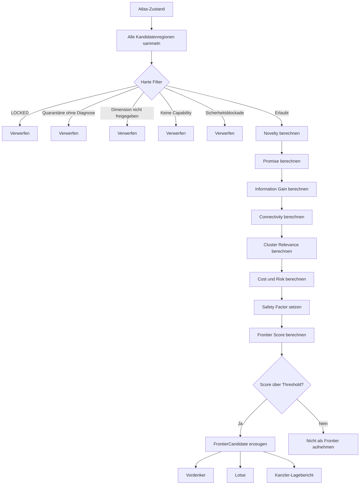

---

## 16. Frontier-Knotendiagramm

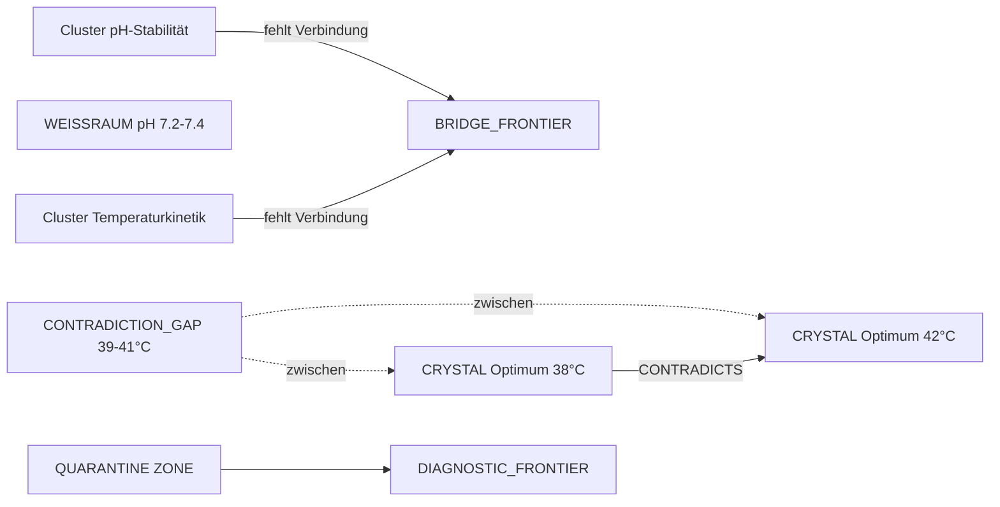

---

## 17. Autonome Themenbearbeitung

Für die autonome Bearbeitung eines Themas führt der Atlas eine zusätzliche Agenda-Schicht ein.

---

### 17.1 ResearchTopic

```python
class ResearchTopic:
    topic_id: str
    name: str
    description: str
    priority: float
    parent_goal: Optional[str]
    related_dimensions: list[str]
    related_zones: list[str]
    related_clusters: list[str]
    budget_class: LOW | MEDIUM | HIGH
    state: PROPOSED | ACTIVE | SATURATED | BLOCKED | ARCHIVED
    stop_conditions: list[StopCondition]
    created_at: str
    updated_at: str
```

---

### 17.2 Themenzustände

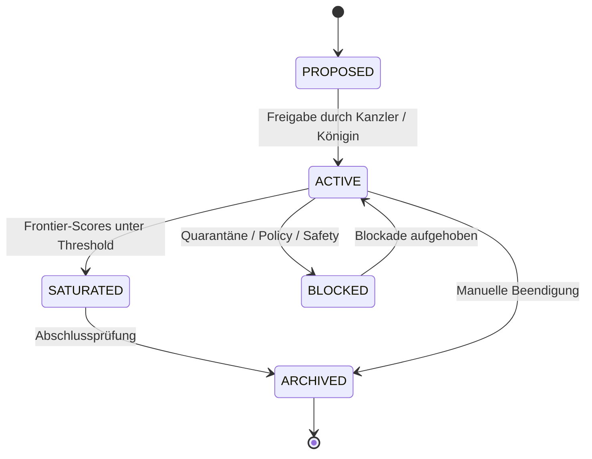

---

### 17.3 Sättigung eines Themas

Ein Thema gilt als gesättigt, wenn mindestens eine der folgenden Bedingungen erfüllt ist:

```text
1. Keine relevanten FrontierCandidates über Score-Schwelle.
2. Die relevanten Zonen sind HEALTHY und ausreichend abgedeckt.
3. Offene Widersprüche sind aufgelöst.
4. Budgetgrenze ist erreicht.
5. Zeitgrenze ist erreicht.
6. Policy- oder Safety-Blockade verhindert weitere Forschung.
7. Thema wurde manuell abgeschlossen.
```

Empfohlene Bedingung:

```text
Wenn für N aufeinanderfolgende Zyklen kein FrontierCandidate
mit frontier_score >= frontier_activation_threshold existiert,
kann das Thema als SATURATED markiert werden.
```

Default:

```text
N = 3
frontier_activation_threshold = 0.40
```

---

### 17.4 Next-Best-Topic

Wenn ein Thema gesättigt ist, kann die Frontier-Engine das nächste Thema vorschlagen:

```text
next_best_topic =
    höchstpriorisiertes Thema mit aktiven FrontierCandidates
    und ausreichender Sicherheit
    und verfügbarem Budget
```

Regel:

> Die Auswahl ist deterministisch.  
> Eine LLM darf Themen vorschlagen oder priorisieren helfen, aber nicht final entscheiden.

---

## 18. Query-API für Agenten

Der Atlas muss für Agenten maschinenlesbar sein.

Empfohlene Query-Schnittstelle:

```python
class AtlasQueryInterface:

    # Topologie
    def get_zone(self, zone_id: str) -> AtlasZone: ...
    def get_dimension(self, dimension_id: str) -> DimensionDefinition: ...
    def get_clusters(self) -> list[AtlasCluster]: ...

    # Evidenz
    def get_zone_context(self, zone_id: str) -> ZoneContext: ...
    def get_node_evidence(self, node_id: str) -> list[SignalEvent]: ...
    def get_contradictions(self, node_id: str) -> list[AtlasEdge]: ...

    # Gesundheit
    def get_zone_health(self, zone_id: str) -> ZoneHealthSummary: ...
    def get_quarantined_zones(self) -> list[str]: ...
    def get_locked_zones(self) -> list[str]: ...

    # Exploration
    def get_research_frontiers(
        self,
        topic_id: Optional[str],
        limit: int
    ) -> list[FrontierCandidate]: ...

    def get_contradiction_gaps(self, zone_id: str) -> list[FrontierCandidate]: ...
    def get_diagnostic_candidates(self, zone_id: str) -> list[FrontierCandidate]: ...
    def get_explorable_zones(self) -> list[str]: ...

    # Themen
    def get_active_topics(self) -> list[ResearchTopic]: ...
    def get_topic_status(self, topic_id: str) -> TopicStatus: ...
    def get_next_best_topics(self, limit: int) -> list[ResearchTopic]: ...

    # Governance
    def get_blocked_ideas(self, zone_id: str) -> list[BlockedIdea]: ...
    def get_policy_vetoes(self, zone_id: str) -> list[PolicyVetoRecord]: ...
```

---

## 19. Zugriffsmatrix

Diese Matrix beschreibt, welche Komponente den Atlas lesen oder schreiben darf.

| Komponente | Atlas lesen | Atlas schreiben | Signale schreiben | Frontiers schreiben | Governance schreiben |
|---|---:|---:|---:|---:|---:|
| Archivar | ✅ | ❌ | ✅ via Kartograph | ❌ | ❌ |
| Kartograph | ✅ | ✅ | ✅ | ✅ | ❌ |
| Kanzler | ✅ | ❌ | ❌ | ❌ | ✅ |
| Königin | ✅ | ❌ | ❌ | ❌ | ✅ |
| Vordenker | ✅ | ❌ | ❌ | ❌ | ❌ |
| Pre-Filter | ✅ | ❌ | ❌ | ❌ | ❌ |
| Lotse | ✅ | ✅ Wegmarken | ❌ | ❌ | ❌ |
| Quartiermeister | ✅ | ❌ | ❌ | ❌ | ❌ |
| Richter | ✅ | ❌ | ❌ | ❌ | ❌ |
| Seher | ✅ eingeschränkt | ❌ | ❌ niemals 🟥 | ❌ | ❌ |
| Dispatcher | ✅ | ❌ | ❌ | ❌ | ❌ |
| Receiver | ❌ | ❌ | ❌ | ❌ | ❌ |
| Questor | ❌ | ❌ | ❌ | ❌ | ❌ |
| HAL | ❌ | ❌ | ❌ | ❌ | ❌ |

Wichtige Regeln:

- Questor schreibt niemals in Atlas oder Archiv.
- HAL schreibt niemals wissenschaftliche Daten.
- Seher schreibt niemals direkt 🟥.
- Operationale Fehler erzeugen keine wissenschaftlichen Signale.
- Sicherheitsrelevante rote Signale entstehen nur deterministisch oder nach Sicherheitsprüfung.

---

## 20. Integration in die 9-Stufen-Pipeline

```mermaid
flowchart LR
    S8[Stufe 8: Questor Ergebnis] --> S1[Stufe 1: Archivar]
    S1 --> S2[Stufe 2: Kartograph]
    S2 --> ATLAS[Atlas Hybrid Modell]
    ATLAS --> FE[Frontier-Engine]
    FE --> S4[Stufe 4: Vordenker]
    S4 --> S5a[Stufe 5a: Pre-Filter]
    S5a --> S5b[Stufe 5b: Lotse]
    S5b --> S6[Stufe 6: Quartiermeister]
    S6 --> S7[Stufe 7: Sicherheits-Gate]
    S7 --> S8b[Stufe 8: Dispatcher / Questor]
    S8b --> S8
```

---

### 20.1 Stufe 1: Archivar

Der Archivar empfängt das `questor_ergebnis_paket`.

Er prüft:

- `idempotency_key`
- `sequence_number`
- `vollstaendig_flag`
- `abbruch_klasse`

Regeln:

```text
OPERATIONAL:
    kein wissenschaftliches Signal

SCIENTIFIC:
    Kristalle und Signale möglich

SAFETY:
    keine wissenschaftlichen Signale aus Questor
    Sicherheitsprüfung über separaten Sicherheitsprozess
```

---

### 20.2 Stufe 2: Kartograph

Der Kartograph:

- aktualisiert Knoten,
- aktualisiert Zonen,
- berechnet Energiekonten,
- berechnet `fracture_score`,
- berechnet `uncertainty_score`,
- prüft Kristallisation,
- aktualisiert Cluster,
- aktualisiert Quarantäne,
- aktualisiert Frontier-Engine.

---

### 20.3 Stufe 4: Vordenker

Der Vordenker nutzt:

- FrontierCandidates,
- Atlas-Muster,
- ResearchTopics,
- offene Hypothesen,
- Widersprüche,
- Weißraum.

Er erzeugt Roh-Ideen mit `prozess_skizze`.

---

### 20.4 Stufe 5a: Pre-Filter

Der Pre-Filter prüft deterministisch:

- Dimension-Freigaben,
- Quarantäne,
- LOCKED,
- Sättigung,
- Policy-Vetos,
- Budgetgrenzen,
- Sicherheitsstatus.

---

### 20.5 Stufe 5b: Lotse

Der Lotse platziert Wegmarken:

- in erlaubten Zonen,
- auf Basis von FrontierCandidates,
- mit geeignetem Intent,
- mit Diagnose-Budget bei Quarantäne.

---

### 20.6 Stufe 6: Quartiermeister

Der Quartiermeister baut das `ResearchPackage`.

Er setzt:

- Routing-Graph,
- Parameter-Bounds,
- Capabilities,
- Budget,
- `autonomy_level`,
- `planning_hints`,
- `questor_spec`.

Bei Diagnose:

```text
autonomy_level = STRICT
gate_mode = FRACTURE_DIAGNOSIS
```

---

### 20.7 Stufe 7: Sicherheits-Gate

Das Gate bleibt absolut.

Regeln:

- Richter entscheidet deterministisch.
- Seher ist nur Advisor.
- Seher schreibt niemals 🟥.
- Gate kann nicht von Questor umgangen werden.
- `gate_record_ref` ist Pflicht.

---

## 21. Datenmodell-Diagramm

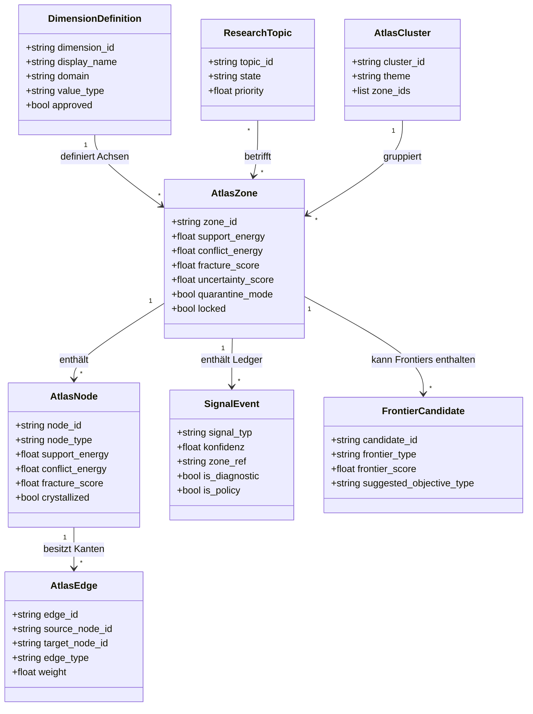

---

## 22. Beispielhafter Atlas-Knotengraph

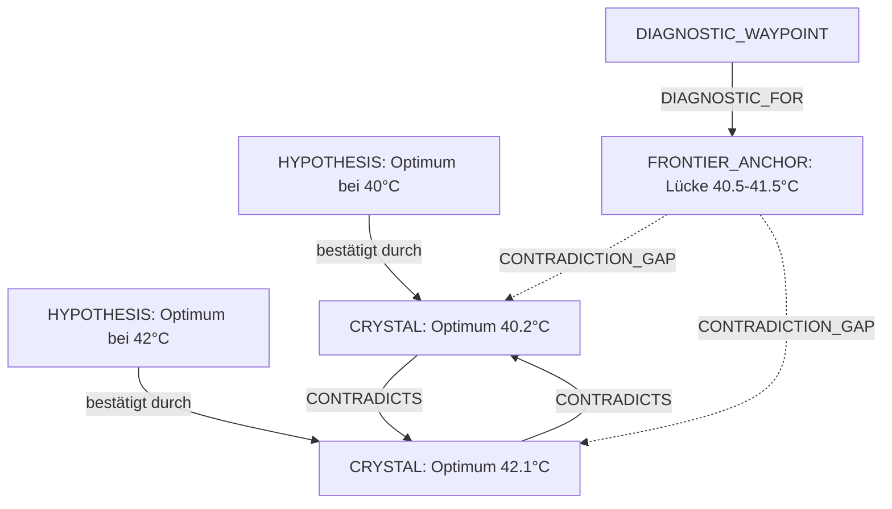

---

## 23. Beispiel: Frontier-Empfehlung

```json
{
  "candidate_id": "frontier-2026-001",
  "frontier_type": "CONTRADICTION_GAP",
  "zone_id": "zone-temperatur-40-43",
  "coordinates": {
    "temperatur": [40.5, 41.5]
  },
  "frontier_score": 0.83,
  "novelty_score": 0.78,
  "promise_score": 0.85,
  "information_gain_score": 0.91,
  "connectivity_score": 0.72,
  "cluster_relevance_score": 0.80,
  "estimated_cost": 0.35,
  "risk_score": 0.12,
  "safety_status": "CLEAR",
  "quarantine_mode": false,
  "locked": false,
  "suggested_objective_type": "DIAGNOSE",
  "suggested_gate_mode": "FRACTURE_DIAGNOSIS",
  "required_capabilities": [
    "incubator.set_temperature",
    "sensor.measure"
  ],
  "reason": "Zwei Kristalle widersprechen sich bei 40.2°C und 42.1°C. Der Bereich dazwischen ist unerforscht.",
  "topic_refs": [
    "topic-temperatur-optimum"
  ]
}
```

---

## 24. Konfigurationsparameter

| Parameter | Default | Bereich | Bedeutung |
|---|---:|---:|---|
| `signal_decay_lambda` | `0.08` | `0.01–0.5` | Zerfallsrate |
| `signal_ttl_cycles` | `50` | `10–200` | Lebensdauer aktiver Signale |
| `min_evidence_mass` | `0.20` | `0.05–1.0` | Schwelle für UNEXPLORED |
| `epsilon` | `0.001` | `>0` | Verhindert Division durch Null |
| `K_conf` | `1.0` | `0.1–10.0` | Sättigung der Support-Confidence |
| `K_evidence` | `2.0` | `0.1–10.0` | Sättigung der Evidence-Scarcity |
| `degraded_threshold` | `0.30` | `0.1–0.5` | DEGRADED-Schwelle |
| `quarantine_threshold` | `0.60` | `0.3–0.9` | Quarantäne-Schwelle |
| `full_rebuild_threshold` | `0.85` | `0.6–1.0` | FULL_REBUILD-Schwelle |
| `healthy_confidence` | `0.70` | `0.5–0.95` | HEALTHY-Schwelle |
| `crystallization_threshold` | `1.0` | `0.5–5.0` | Energie-Schwelle für Kristallisation |
| `min_confirmations` | `3` | `1–10` | Mindestanzahl grüner Signale |
| `interrupt_window` | `5` | `3–20` | Fenster für Fraktur-Interrupt |
| `max_fracture_for_crystallization` | `0.30` | `0.1–0.6` | Maximale Fracture für Kristallisation |
| `diagnostic_budget_default` | `3` | `1–10` | Diagnose-Budget pro Zone |
| `frontier_activation_threshold` | `0.40` | `0.1–0.9` | Schwelle für aktive Frontiers |
| `policy_veto_review_interval_cycles` | `20` | `1–500` | Review-Intervall für Policy-Vetos |

---

## 25. Invarianten

| Invariante | Regel |
|---|---|
| Leere Zone | Eine Zone ohne Evidenz ist niemals `HEALTHY` oder `DEGRADED`, sondern `UNEXPLORED` |
| Weiß | ⬜ verändert weder Support noch Conflict |
| Operational | Operationale Fehler erzeugen keine wissenschaftlichen Signale |
| Questor | Questor schreibt niemals in Atlas oder Archiv |
| HAL | HAL schreibt niemals wissenschaftliche Daten |
| LLM | LLM schreibt niemals finale Sicherheitsentscheidungen |
| Seher | Seher schreibt niemals 🟥 |
| Rot | 🟥 entsteht nur deterministisch oder nach Sicherheitsprüfung |
| Diagnose | Diagnose-Signale erhöhen nicht automatisch die wissenschaftliche Fracture |
| Policy | Policy-Vetos blockieren Aktionen, sind aber nicht automatisch wissenschaftlicher Widerspruch |
| Quarantäne | Quarantäne wird fail-closed aktiviert |
| LOCKED | LOCKED überschreibt alle anderen Freigaben |
| Append-Only | Signal-Ledger werden nicht nachträglich gelöscht |
| Versionierung | `atlas_version_ref` bleibt Pass-Through für Questor |

---

## 26. Validierungs- und Testanforderungen

Für die Einführung dieses Modells sind mindestens folgende Tests erforderlich:

### 26.1 Grundzustände

- [ ] Eine Zone ohne Signale ist `UNEXPLORED`.
- [ ] Eine Zone mit nur ⬜ Signalen bleibt `UNEXPLORED`.
- [ ] Eine Zone mit nur 🟩 Signalen kann `HEALTHY` werden.
- [ ] Eine Zone mit vielen 🟨 Signalen wird `DEGRADED`.
- [ ] Eine Zone mit sehr hoher Conflict-Energie wird `CRITICAL`.
- [ ] Eine Zone mit `locked = true` ist unabhängig von Scores gesperrt.

### 26.2 Signalwirkung

- [ ] 🟩 erhöht `support_energy`.
- [ ] 🟨 erhöht `conflict_energy`.
- [ ] 🟥 erhöht `conflict_energy` stark.
- [ ] ⬜ verändert keine Evidenzkonten.
- [ ] 🟪 diagnostic erhöht nur `diagnostic_energy`.
- [ ] 🟪 policy erhöht nur `policy_energy`.
- [ ] `konfidenz` skaliert die effektive Wirkung.
- [ ] Alte Signale verlieren über Decay an Gewicht.

### 26.3 Kristallisation

- [ ] Kristallisation erfolgt erst bei ausreichend Support-Energie.
- [ ] Kristallisation erfordert mindestens drei relevante Bestätigungen.
- [ ] Kristallisation wird durch starke Widersprüche blockiert.
- [ ] Kristallisation ist in LOCKED-Zonen verboten.
- [ ] Kristallisation ist in Quarantäne-Zonen ohne Diagnosefreigabe verboten.
- [ ] Ein neuer Kristall kann `SUPPORTS`, `EXTENDS` oder `DERIVED_FROM` Kanten erhalten.

### 26.4 Diagnose

- [ ] Quarantäne erlaubt nur Diagnose bei vorhandenem Budget.
- [ ] DiagnosticWaypoints reduzieren das Diagnose-Budget.
- [ ] Bei Budget 0 ist keine weitere Diagnose erlaubt.
- [ ] Diagnostic-Kristalle fließen nicht in normale Cluster ein.

### 26.5 Frontier-Engine

- [ ] Eine leere Zone mit Anschluss erzeugt eine `WEISSRAUM` Frontier.
- [ ] Zwei widersprüchliche Kristalle können eine `CONTRADICTION_GAP` erzeugen.
- [ ] Fehlende Cluster-Verbindungen können eine `BRIDGE_FRONTIER` erzeugen.
- [ ] LOCKED verhindert jede Frontier.
- [ ] Quarantäne erzeugt nur Diagnose-Frontiers.
- [ ] FrontierCandidates enthalten eine nachvollziehbare Begründung.

### 26.6 Themenautonomie

- [ ] Ein Thema wird `ACTIVE`, wenn es freigegeben ist.
- [ ] Ein Thema wird `SATURATED`, wenn keine relevanten Frontiers mehr existieren.
- [ ] Ein Thema wird `BLOCKED`, wenn Quarantäne oder Policy-Veto aktiv ist.
- [ ] Ein neues Thema kann nach Sättigung vorgeschlagen werden.

---

## 27. Migration aus dem bestehenden Atlas-Modell

Das bestehende Atlas-Modell in `GREMIUM.md §6` kann schrittweise migriert werden.

---

### 27.1 Beibehalten

- Signal-Typen: 🟥, 🟨, 🟪, 🟩, ⬜
- Append-Only-Charakter von Signalen
- Zone-Health-Grundidee
- Quarantäne
- FULL_REBUILD
- NEUAUSRICHTEN
- Kristallbildung
- Diagnose-Budget

---

### 27.2 Ersetzen

| Alt | Neu |
|---|---|
| Reine Signalpriorität | Energiebilanz mit Konfidenz und Decay |
| Kristallisation nur nach 3 Bestätigungen | Kristallisationsfortschritt + Bedingungen |
| Fracture nur aus roten Signalen | Fracture aus Conflict-/Support-Energie |
| Keine explizite Leere-Logik | `UNEXPLORED` + Frontier-Engine |
| Keine Frontier-Karte | FrontierCandidates |
| Keine ResearchTopics | Autonome Themenbearbeitung |

---

### 27.3 Ergänzungen

- `AtlasNode`
- `AtlasEdge`
- `FrontierCandidate`
- `ResearchTopic`
- `DiagnosticWaypoint`
- `DimensionOnboardingRequest`
- `AtlasSnapshot`
- `uncertainty_score`
- `policy_energy`
- `diagnostic_energy`

---

## 28. Empfohlene Implementierungsphasen

### Phase A: Evidenzkern

Ziel:

- SignalEvent erweitern
- Energiekonten einführen
- `fracture_score` neu berechnen
- `UNEXPLORED` einführen

---

### Phase B: Wissensgraph

Ziel:

- `AtlasNode`
- `AtlasEdge`
- Kristallisation als Phasenübergang
- wissenschaftliche Kanten

---

### Phase C: Integrität und Quarantäne

Ziel:

- Zone-Health neu berechnen
- Quarantäne-Modus
- LOCKED
- FULL_REBUILD
- Diagnose-Budget

---

### Phase D: Frontier-Engine

Ziel:

- FrontierCandidates
- Frontier-Score
- Frontier-Typen
- Query-API für Vordenker und Lotse

---

### Phase E: Autonome Themen

Ziel:

- ResearchTopic
- Topic-Saturation
- Next-Best-Topic
- Integration in Kanzler-Lageberichte

---

## 29. Offene Punkte

Folgende Punkte sollten vor der Bindung endgültig entschieden werden:

1. Sollen `fracture_score` und `support_confidence` pro Zone, pro Knoten oder both geführt werden?
2. Wie stark darf `policy_energy` die Frontier-Bewertung beeinflussen?
3. Soll `uncertainty_score` direkt in `frontier_score` einfließen oder nur als Filter?
4. Wie werden kategorische Dimensionen in Zonen und Frontiers diskretisiert?
5. Wie oft darf die Frontier-Engine laufen?
6. Wie viele FrontierCandidates dürfen pro Zyklus erzeugt werden?
7. Wer darf `ResearchTopic` erstellen: Kanzler, Königin, Vordenker?
8. Wie wird Themenpriorität strategisch gewichtet?
9. Wie werden FRONTIER_ANCHOR-Knoten von normalen HYPOTHESIS-Knoten getrennt?
10. Wie wird ein FULL_REBUILD mit offenen ResearchTopics synchronisiert?

---

## 30. Fazit

Dieses Hybridmodell definiert den Atlas als:

> **Eine topologisch strukturierte, evidenzbilanzierte, semantisch vernetzte und explorationsfähige Wissenschaftskarte.**

Es vereint:

- die Robustheit einer Energiebilanz,
- die Nachvollziehbarkeit eines Wissensgraphen,
- die Klarheit einer Topologie,
- die Sicherheit von Governance,
- und die Autonomie einer Frontier-Karte.

Damit kann das System:

- Themen selbstständig bearbeiten,
- danach weiterforschen,
- sinnvolle leere Stellen finden,
- Wissenslücken schließen,
- Widersprüche diagnostizieren,
- und Agenten optimale nächste Schritte vorschlagen.