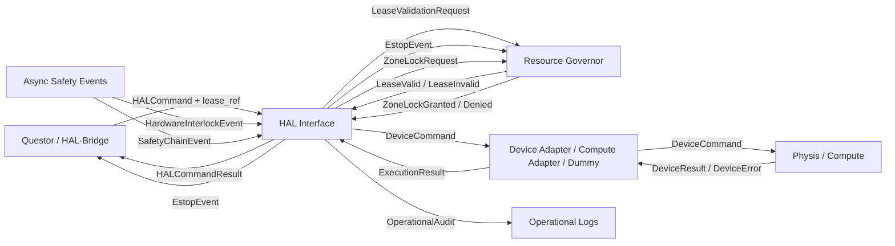

# 🔌 HAL V0.2.0 — HARDWARE ABSTRACTION LAYER FÜR MYRMEX V2.4.0

**Dateiname:** `structure_hal_v0.2.0.md`
**HAL-Version:** 0.2.0
**System:** MYRMEX v2.4.0 + Questor v0.2.3
**Status:** Verbindlicher HAL-Vertrag für Implementierung und Integration
**Bezug:** `structure_standalone_v2.4.0.md`, Strukturversion 1.1.1
**Testbezug:** `myrmex_questor_integration_tests_v0.3.1.md`
**Sprache:** Deutsch
**Freigabezustand:** Keine Implementierungsfreigabe; Standardmodus ist Dry-Run

---

## 0. Dokumentenhierarchie und Geltung

Diese HAL-Datei ist eine **spezialisierte Strukturdatei** für die HAL-Schicht.

Sie steht unterhalb der kanonischen Hauptreferenz:

1. `structure_standalone_v2.4.0.md`, Strukturversion 1.1.1
2. diese Datei: `structure_hal_v0.2.0.md`
3. spätere HAL-Implementierungsdokumente oder Device-Adapter-Dokumente

Wenn diese Datei im Widerspruch zur Hauptreferenz steht, gilt die Hauptreferenz.

---

## 1. Änderungen gegenüber HAL v0.1.0

Diese Version ist ein **fundamentaler Ausbau** gegenüber HAL v0.1.0.

Die folgenden Konzepte sind neu:

1. **Langzeit-Prozessmodell** mit sicheren Hold-/Resume-Zuständen
2. **Hardware-Interlock-Modell** als latchende, asynchrone Sicherheitsereignisse
3. **Zonenbasierte Mutex-Modellierung** für geteilte physische Räume
4. **Compute-Ressourcenmodell** zur Unterscheidung von Labor-Aktuatorik und Compute
5. **Parameter-Schema-Registry** für sichere Geräteprofile

Die folgenden Konzepte aus v0.1.0 bleiben unverändert:

- Fail-Closed-Prinzip
- HAL vergibt keine Leases
- Strikte Trennung OPERATIONAL / SAFETY
- Keine wissenschaftliche Interpretation
- Keine Blackbox-Übergabe an das Gremium
- Dummy-HAL für Tests

---

## 2. Zweck dieser Datei

Diese Datei definiert:

- die Verantwortung von HAL
- die Abgrenzung von HAL gegenüber Questor, Resource Governor und Gremium
- die HAL-Schnittstellen
- die HAL-Datenverträge
- die HAL-Zustandsmaschinen
- das Langzeit-Prozessmodell
- das Hardware-Interlock-Modell
- die zonenbasierte Mutex-Modellierung
- das Compute-Ressourcenmodell
- die Parameter-Schema-Registry
- das HAL-Fehlermodell
- ESTOP-Logik
- Lease-Validierung
- Idempotenz
- Crash-Recovery
- Audit- und Logging-Regeln
- Dummy-HAL-Anforderungen
- Testanforderungen

---

## 3. HAL im Gesamtsystem

HAL ist Schicht 1 im MYRMEX-System.

| Schicht | Name | Verantwortung |
|---|---|---|
| 5 | 👑 Königin | Langfristige Vision, Meta-Ziele |
| 4 | 🏛️ Gremium | Intelligenz, Atlas, Archiv, Pakete, Sicherheit |
| 3 | ⚖️ Dispatch-Koordination | Dispatch-Vorbereitung, Lease-/Gate-Koordination |
| 2 | 🧭 Questor | Paketgebundenes Execution Subsystem |
| 1 | 🔌 HAL & Resource Governor | Slot-Routing, Leases, ESTOP, Hardwarezugriff |
| 0 | ⚙️ Physis / Compute | Hardware, Simulation, Compute |

HAL ist die einzige technisch kontrollierte Schnittstelle zur Physis und zum Compute.

Questor entscheidet, was innerhalb eines Pakets ausgeführt werden soll.

Resource Governor entscheidet, wer welche Ressource nutzen darf.

HAL führt nur technisch kontrolliert aus.

---

## 4. Datenflussdiagramm



ASCII-Fallback:

```text
Questor / HAL-Bridge
       |
       | HALCommand + lease_ref
       v
   HAL Interface
       |
       | LeaseValidationRequest
       +----> Resource Governor
       |
       | ZoneLockRequest
       +----> Resource Governor
       |
       | DeviceCommand
       v
Device Adapter / Compute Adapter / Dummy
       |
       v
Physis / Compute
       |
       | DeviceResult / DeviceError / InterlockEvent
       v
   HAL Interface
       |
       | HALCommandResult
       v
Questor / HAL-Bridge

Async Safety Events:
  HardwareInterlockEvent -> HAL
  SafetyChainEvent -> HAL

HAL kann zusätzlich:
  EstopEvent -> Resource Governor
  EstopEvent -> Questor
  OperationalAudit -> Operational Logs
```

---

## 5. Verantwortung von HAL

### 5.1 HAL darf

HAL darf:

- Hardware- oder Compute-Kommandos ausführen
- Slot-Zustände melden
- Lease-Referenzen formal prüfen oder durch den Resource Governor prüfen lassen
- ESTOP melden und ESTOP-Zustände verwalten
- Hardware-Interlocks erkennen und melden
- Zonen-Locks anfragen und verwalten
- Langzeit-Prozesse verwalten (Start, Hold, Resume, Abort)
- technische Fehler operational melden
- Sicherheitsfehler als SAFETY melden
- Kommandos idempotent behandeln
- Audit-Logs für Operationen schreiben
- Dummy-Modi für Tests bereitstellen
- unklare Zustände nach Crash als unsicher melden

### 5.2 HAL darf nicht

HAL darf nicht:

- Leases vergeben
- Leases verlängern
- Leases eigenmächtig erneuern
- wissenschaftliche Ziele interpretieren
- Atlas-Signale schreiben
- Archiv-Einträge schreiben
- Kristalle erzeugen
- Wegmarken erzeugen
- Ideen bewerten
- Questor-Logik ersetzen
- ESTOP eigenmächtig zurücksetzen
- Hardware-Interlocks eigenmächtig zurücksetzen
- Blackbox-Inhalte an das Gremium weitergeben
- finale Sicherheitsfreigaben erteilen
- LLM-Entscheidungen als sicherheitskritische Endentscheidung nutzen

---

## 6. HAL-Grundprinzipien

### 6.1 Dünne Schicht

HAL bleibt bewusst dünn.

Intelligenz bleibt bei:

- Gremium
- Questor
- Resource Governor

HAL ist:

- ausführungsorientiert
- zustandsorientiert
- sicherheitsbegrenzend
- deterministisch
- testbar
- auditierbar

### 6.2 Deterministisch vor LLM

HAL enthält keine LLM-Logik.

HAL-Entscheidungen sind deterministisch:

- Lease gültig oder nicht
- Slot frei oder belegt
- Zone gesperrt oder nicht
- ESTOP aktiv oder nicht
- Interlock gelatched oder nicht
- Timeout eingetreten oder nicht
- Kommando erfolgreich oder fehlgeschlagen

### 6.3 Fail-Closed

Wenn ein Zustand nicht sicher bestimmt werden kann:

- kein Kommando ausführen
- keinen Slot freigeben
- keine Lease akzeptieren
- keine Zone freigeben
- keine physische Aktion starten
- Zustand als unsicher oder Fehler melden

### 6.4 Keine wissenschaftliche Interpretation

HAL erhält keine Forschungsziele.

HAL erhält nur:

- technische Kommandos
- Slot-Referenzen
- Lease-Referenzen
- Parameter
- Timeouts
- Sicherheitsmodus
- Prozess-Referenzen

HAL meldet keine wissenschaftlichen Kategorien wie:

```text
TARGET_NOT_REACHED
HYPOTHESIS_FAILED
SCIENTIFIC_CONTRADICTION
```

### 6.5 Trennung von Kommando und Prozess

HAL unterscheidet strikt zwischen:

```text
command_timeout
  = Wie lange darf der RPC-/Kommandoaufruf dauern?

process_duration
  = Wie lange läuft der physikalische oder Compute-Prozess auf dem Gerät?
```

Diese Trennung ist zwingend für Langzeit-Experimente.

---

## 7. HAL-Knoten

Die folgenden Knoten gehören zur HAL-Welt.

### 7.1 HAL Interface

Der zentrale Vertragsendpunkt.

Er bietet:

```text
get_environment_manifest()
get_slot_state(slot_id)
get_zone_state(zone_id)
execute_command(command)
start_process(process_command)
monitor_process(process_id)
hold_process(process_id)
resume_process(process_id, resume_token)
abort_process(process_id)
release_stage(process_id, stage_id, release_authority)
report_estop(reason, trigger_source)
report_hardware_interlock(interlock_event)
get_estop_state()
reconcile_slot_state(slot_id)
reconcile_process_state(process_id)
get_command_status(command_id)
```

### 7.2 Device Adapter

Der Device Adapter ist die geräte- oder compute-spezifische Umsetzung.

Mögliche Adapter:

- DummyAdapter
- SimulationAdapter
- ComputeAdapter
- LabHardwareAdapter
- SandboxAdapter
- LiquidHandlerAdapter
- ReactorAdapter
- IncubatorAdapter
- GPUClusterAdapter

Der Adapter darf keine Lease vergeben.

Der Adapter darf keine Sicherheitsregeln umgehen.

### 7.3 Slot State Store

Verwaltet Slot-Zustände.

Quelle der Wahrheit für Leases ist nicht HAL, sondern der Resource Governor.

HAL darf Slot-Zustände technisch führen, aber Lease-Gültigkeit nicht eigenmächtig erzeugen.

### 7.4 Process State Store

Verwaltet Langzeit-Prozess-Zustände.

Für jedes aktive Gerät oder Compute-Job wird ein Prozesszustand geführt:

```text
process_id
device_job_id
process_state
resume_token
safe_hold_policy
stage_release_policy
```

### 7.5 Zone Lock Manager

Verwaltet zonenbasierte Mutex-Locks.

Zonen können sein:

- gemeinsame Schienen
- kinematische Kollisionsräume
- Plattenpositionen
- Sicherheitsräume

HAL fragt Zonen-Locks beim Resource Governor an.

HAL verwaltet Zonen-Locks nicht eigenmächtig.

### 7.6 ESTOP Handler

Verwaltet:

- ESTOP-Ereignisse
- ESTOP-Zustände
- Hardware-Interlock-Ereignisse
- betroffene Slots
- suspendierte Leases
- Audit-Events
- Reset-Anfragen

### 7.7 Operational Audit Writer

Schreibt HAL-Ereignisse nach:

```text
data/operational_logs/
```

Diese Logs sind operational, nicht wissenschaftlich.

---

## 8. Datenverträge

Die folgenden Datenverträge sind für HAL v0.2.0 verbindlich.

---

### 8.1 EnvironmentManifest

```text
EnvironmentManifest:
  environment_id: str
  environment_version: str
  schema_version: str
  slots: list[SlotDescriptor]
  mutex_zones: list[MutexZone]
  capabilities: list[str]
  estop_mechanism: str
  max_command_timeout_s: float
  default_lease_ttl_s: float
  heartbeat_interval_s: float
  supported_security_modes: list[str]
  supported_resource_classes: list[str]
```

Regeln:

- Keine wissenschaftlichen Daten.
- Keine Atlas-Inhalte.
- Keine Paketinhalte.
- Nur technische Umgebung.

---

### 8.2 SlotDescriptor

```text
SlotDescriptor:
  slot_id: str
  display_name: Optional[str]
  resource_class: LAB_ACTUATOR | COMPUTE_NODE | SIMULATION_ENVIRONMENT | SANDBOX_ENVIRONMENT | HYBRID_SLOT
  capabilities: list[str]
  mutex_group: str
  physical_zones: list[str]
  physical_actuation: bool
  compute_capable: bool
  sandbox_capable: bool
  kinematic_collision_class: Optional[str]
  requires_path_reservation: bool
  max_concurrent_commands: int
  estop_controllable: bool
  max_command_timeout_s: float
  max_process_duration_s: float
  max_parameter_payload_bytes: int
  supported_process_modes: list[str]
  accelerator_type: Optional[str]
  accelerator_count: int
  accelerator_memory_gb: Optional[float]
  supported_runtimes: list[str]
```

Regeln:

- `resource_class` ist Pflicht.
- `physical_actuation = true` bedeutet echte physische Wirkung.
- `compute_capable = true` bedeutet Compute-Ausführung.
- `sandbox_capable = true` bedeutet kontrollierte Simulation oder Sandbox.
- `max_concurrent_commands` ist standardmäßig 1.
- Wenn `physical_actuation = false` und `compute_capable = false`, darf der Slot keine Ausführung entfalten.

---

### 8.3 MutexZone

```text
MutexZone:
  zone_id: str
  display_name: Optional[str]
  member_slots: list[str]
  lock_policy: EXCLUSIVE | SINGLE_OCCUPANT | PATH_RESERVATION | CONTAINER_LOCK
  dynamic_lock_required: bool
  estop_relevant: bool
  max_hold_time_s: float
```

Regeln:

- `lock_policy = EXCLUSIVE`: Nur ein Slot darf die Zone gleichzeitig nutzen.
- `lock_policy = SINGLE_OCCUPANT`: Nur ein physisches Objekt darf die Zone belegen.
- `lock_policy = PATH_RESERVATION`: Fahrwege müssen reserviert werden.
- `lock_policy = CONTAINER_LOCK`: Behälterpositionen sind exklusiv.
- `dynamic_lock_required = true`: Lock muss zur Laufzeit angefragt werden.
- `estop_relevant = true`: ESTOP betrifft diese Zone.

---

### 8.4 SlotState

```text
SlotState:
  slot_id: str
  status: FREE | RESERVED | ACTIVE | ERROR | ESTOP_SUSPENDED | INTERLOCKED | MAINTENANCE | OFFLINE
  device_reachable: bool
  interlock_latched: bool
  interlock_source: Optional[str]
  safe_state_verified: bool
  manual_reset_required: bool
  current_lease_ref: Optional[str]
  current_process_id: Optional[str]
  heartbeat_expires_at: Optional[str]
  last_error: Optional[str]
  last_command_id: Optional[str]
  last_state_change_at: str
```

Neue Zustände gegenüber v0.1.0:

- `INTERLOCKED`: Hardware-Interlock ist aktiv. Härter als `ESTOP_SUSPENDED`.
- `device_reachable`: Gibt an, ob die Hardware erreichbar ist.
- `interlock_latched`: Gibt an, ob ein Hardware-Interlock gelatched ist.
- `safe_state_verified`: Gibt an, ob der sichere Zustand verifiziert wurde.
- `manual_reset_required`: Gibt an, ob ein manueller Reset erforderlich ist.

---

### 8.5 ZoneState

```text
ZoneState:
  zone_id: str
  status: FREE | LOCKED | PATH_RESERVED | ESTOP_SUSPENDED | INTERLOCKED | MAINTENANCE
  current_holder_slot_id: Optional[str]
  lock_policy: EXCLUSIVE | SINGLE_OCCUPANT | PATH_RESERVATION | CONTAINER_LOCK
  lock_expires_at: Optional[str]
  last_state_change_at: str
```

---

### 8.6 ProcessState

```text
ProcessState:
  process_id: str
  device_job_id: Optional[str]
  slot_id: str
  lease_ref: str
  process_state: PENDING | RUNNING | PAUSED | SAFE_HOLD | WAITING_FOR_RELEASE | COMPLETED | ABORTED | FAULT | UNKNOWN
  current_stage: Optional[str]
  started_at: Optional[str]
  expected_duration_s: Optional[float]
  elapsed_time_s: Optional[float]
  resume_token: Optional[str]
  resume_allowed: bool
  safe_hold_active: bool
  manual_release_required: bool
  last_state_change_at: str
  last_error: Optional[str]
```

Regeln:

- `process_state = RUNNING`: Prozess läuft aktiv.
- `process_state = SAFE_HOLD`: Prozess ist sicher angehalten (z.B. bei Lease-Expiry).
- `process_state = WAITING_FOR_RELEASE`: Prozess wartet auf manuelle Freigabe für nächste Stufe.
- `process_state = UNKNOWN`: Zustand ist unklar (z.B. nach Crash).
- `resume_allowed = true`: Prozess darf fortgesetzt werden.
- `safe_hold_active = true`: Prozess ist im sicheren Haltezustand.
- `manual_release_required = true`: Nächste Stufe braucht manuelle Freigabe.

---

### 8.7 HALCommand

```text
HALCommand:
  command_id: str
  idempotency_key: str
  lease_ref: str
  slot_id: str
  capability: str
  operation: str
  parameters: dict[str, any]
  parameter_schema_ref: Optional[str]
  parameter_schema_version: Optional[str]
  parameter_checksum: Optional[str]
  payload_artifact_ref: Optional[str]
  timeout_s: float
  dispatch_mode: NORMAL | RETRY | RECOVERY
  security_mode: NORMAL | SANDBOX | DEV_SANDBOX_ONLY | RECOVERY
  request_source: QUESTOR | MAINTENANCE | TEST
  correlation_id: Optional[str]
```

Neue Felder gegenüber v0.1.0:

- `parameter_schema_ref`: Referenz auf das Schema der Parameter.
- `parameter_schema_version`: Version des Schemas.
- `parameter_checksum`: Prüfsumme der Parameter.
- `payload_artifact_ref`: Referenz auf ein externes Artifact.

Regeln:

- Wenn eine Capability komplexe Profile erwartet, muss `parameter_schema_ref` gesetzt sein.
- Wenn `parameter_schema_ref` gesetzt ist, muss `parameter_checksum` gesetzt sein.
- Wenn Schema unbekannt oder Checksumme falsch: `PARAMETER_INVALID`.

---

### 8.8 ProcessCommand

```text
ProcessCommand:
  process_id: str
  device_job_id: Optional[str]
  lease_ref: str
  slot_id: str
  capability: str
  operation: str
  parameters: dict[str, any]
  parameter_schema_ref: Optional[str]
  parameter_schema_version: Optional[str]
  parameter_checksum: Optional[str]
  payload_artifact_ref: Optional[str]
  process_mode: START | MONITOR | RESUME | HOLD | ABORT | RELEASE_STAGE
  expected_process_duration_s: Optional[float]
  process_recipe_ref: Optional[str]
  process_recipe_checksum: Optional[str]
  on_lease_expiry_policy: SAFE_HOLD | ABORT_TO_SAFE_STATE | CONTINUE_PASSIVE_SAFE | REQUIRES_RECONCILE
  stage_release_policy: Optional[StageReleasePolicy]
  timeout_s: float
  dispatch_mode: NORMAL | RETRY | RECOVERY
  security_mode: NORMAL | SANDBOX | DEV_SANDBOX_ONLY | RECOVERY
  request_source: QUESTOR | MAINTENANCE | TEST
  correlation_id: Optional[str]
```

Neue Konzepte:

- `process_mode`: Steuert, ob ein Prozess gestartet, überwacht, fortgesetzt, angehalten oder abgebrochen wird.
- `expected_process_duration_s`: Erwartete Dauer des physikalischen oder Compute-Prozesses.
- `on_lease_expiry_policy`: Was passiert, wenn die Lease ausläuft.
- `stage_release_policy`: Welche Stufen manuelle Freigabe benötigen.

---

### 8.9 StageReleasePolicy

```text
StageReleasePolicy:
  stages: list[StageRelease]

StageRelease:
  stage_id: str
  release_required: bool
  release_authority: QUESTOR | SAFETY_PROCESS | HUMAN | KANZLER
  auto_start_allowed: bool
  max_wait_time_s: Optional[float]
```

Regeln:

- Wenn `release_required = true`, darf die Stufe nicht automatisch gestartet werden.
- Wenn `auto_start_allowed = false`, muss eine explizite Freigabe erfolgen.
- Sicherheitskritische Stufen (z.B. UV-Exposition) sollten `release_authority = SAFETY_PROCESS_OR_HUMAN` haben.

---

### 8.10 HALCommandResult

```text
HALCommandResult:
  command_id: str
  status: SUCCESS | DENIED | TIMEOUT | ESTOP | INTERLOCK | ERROR | DUPLICATE_BLOCKED | LEASE_INVALID | LEASE_EXPIRED | SLOT_UNAVAILABLE | ZONE_LOCK_UNAVAILABLE
  error_code: Optional[str]
  error_class: Optional[OPERATIONAL | SAFETY]
  slot_state: SlotState
  started_at: Optional[str]
  finished_at: Optional[str]
  receipt_checksum: Optional[str]
  operational_metrics: Optional[dict[str, float]]
```

Neuer Status gegenüber v0.1.0:

- `INTERLOCK`: Hardware-Interlock ist aktiv.

Neuer Fehlercode gegenüber v0.1.0:

- `ZONE_LOCK_UNAVAILABLE`: Zonen-Lock ist nicht verfügbar.

---

### 8.11 ProcessResult

```text
ProcessResult:
  process_id: str
  device_job_id: Optional[str]
  slot_id: str
  process_state: PENDING | RUNNING | PAUSED | SAFE_HOLD | WAITING_FOR_RELEASE | COMPLETED | ABORTED | FAULT | UNKNOWN
  current_stage: Optional[str]
  error_code: Optional[str]
  error_class: Optional[OPERATIONAL | SAFETY]
  started_at: Optional[str]
  finished_at: Optional[str]
  elapsed_time_s: Optional[float]
  resume_token: Optional[str]
  resume_allowed: bool
  operational_metrics: Optional[dict[str, float]]
```

---

### 8.12 HALCommandStatus

Optional, empfohlen für Recovery:

```text
HALCommandStatus:
  command_id: str
  lifecycle_state: RECEIVED | VALIDATING | ACCEPTED | EXECUTING | SUCCESS | FAILED | TIMEOUT | DENIED | ESTOP | INTERLOCK | DUPLICATE_BLOCKED
  attempts: int
  last_error: Optional[str]
  last_update_at: str
```

---

### 8.13 LeaseRef / LeaseToken

HAL vergibt keine Leases.

HAL akzeptiert nur Lease-Referenzen.

Empfohlene Struktur eines Lease-Tokens:

```text
LeaseToken:
  lease_id: str
  slot_id: Optional[str]
  path_id: Optional[str]
  package_id: str
  issued_at: str
  ttl_s: float
  heartbeat_interval_s: float
  physical_execution_allowed: bool
  sandbox_execution_allowed: bool
  compute_execution_allowed: bool
  lease_type: SHORT_COMMAND | LONG_RUNNING_PROCESS
  renewable: bool
  grace_period_s: float
  offline_heartbeat_policy: SAFE_HOLD | REVOKE | RECONCILE_REQUIRED
  signature: str
```

Neue Felder gegenüber v0.1.0:

- `compute_execution_allowed`: Gibt an, ob Compute-Ausführung erlaubt ist.
- `lease_type`: Unterscheidet kurzlebige Kommandos von langlaufenden Prozessen.
- `renewable`: Gibt an, ob die Lease verlängert werden kann.
- `grace_period_s`: Kulanzzeit nach Lease-Expiry.
- `offline_heartbeat_policy`: Was passiert, wenn kein Heartbeat kommt.

---

### 8.14 EstopState

```text
EstopState:
  state: NORMAL | ACTIVE | LATCHED | TEST
  origin: SOFTWARE | HARDWARE_INTERLOCK | EXTERNAL_SAFETY_CHAIN
  hardware_interlock_id: Optional[str]
  physical_reset_required: bool
  safe_state_verified: bool
  inspection_required: bool
  reason: Optional[str]
  trigger_source: Optional[str]
  affected_slots: list[str]
  affected_zones: list[str]
  suspended_leases: list[str]
  timestamp: str
  reset_policy: str
  acknowledged_by: Optional[str]
```

Neue Felder gegenüber v0.1.0:

- `origin`: Unterscheidet Software-ESTOP von Hardware-Interlock.
- `hardware_interlock_id`: Identifiziert den spezifischen Hardware-Interlock.
- `physical_reset_required`: Gibt an, ob ein physischer Reset erforderlich ist.
- `safe_state_verified`: Gibt an, ob der sichere Zustand verifiziert wurde.
- `inspection_required`: Gibt an, ob eine Inspektion erforderlich ist.
- `affected_zones`: Liste der betroffenen Zonen.

---

### 8.15 HardwareInterlockEvent

```text
HardwareInterlockEvent:
  timestamp: str
  slot_id: str
  interlock_source: str
  severity: SAFETY
  affected_commands: list[str]
  suspended_leases: list[str]
  latch_until_manual_reset: bool
  physical_reset_required: bool
  device_reachable: bool
  safe_state_verified: bool
```

Regeln:

- `severity` ist immer `SAFETY`.
- `latch_until_manual_reset = true`: Der Interlock bleibt aktiv, bis er manuell zurückgesetzt wird.
- `physical_reset_required = true`: Ein physischer Reset ist erforderlich.
- `device_reachable = false`: Die Hardware ist nicht erreichbar.
- `safe_state_verified = false`: Der sichere Zustand ist nicht verifiziert.

---

### 8.16 ComputeResourceRequest

```text
ComputeResourceRequest:
  resource_bundle_ref: Optional[str]
  accelerators: list[AcceleratorRequest]
  cpu_cores: Optional[int]
  memory_gb: Optional[float]
  local_scratch_gb: Optional[float]
  network_bandwidth_mbps: Optional[float]

AcceleratorRequest:
  type: str
  count: int
  memory_gb: Optional[float]
```

Regeln:

- Compute-Ressourcen werden als Bundle angefragt.
- HAL delegiert die Zuordnung an den Compute-Adapter.
- Der Compute-Adapter kann ein Scheduler sein (Slurm, Kubernetes, etc.).

---

### 8.17 HALAuditEvent

```text
HALAuditEvent:
  timestamp: str
  event_type: str
  command_id: Optional[str]
  process_id: Optional[str]
  slot_id: Optional[str]
  zone_id: Optional[str]
  lease_id: Optional[str]
  status: Optional[str]
  error_code: Optional[str]
  security_mode: Optional[str]
  request_source: Optional[str]
  interlock_source: Optional[str]
```

Regeln:

- HALAuditEvents sind operational.
- Keine wissenschaftlichen Daten.
- Keine Blackbox-Inhalte.
- Zielverzeichnis: `data/operational_logs/`

---

## 9. Zustandsmaschinen

### 9.1 Slot-Zustände

Zulässige Zustände:

```text
FREE
RESERVED
ACTIVE
ERROR
ESTOP_SUSPENDED
INTERLOCKED
MAINTENANCE
OFFLINE
```

Übergänge:

| Von | Nach | Auslöser |
|---|---|---|
| FREE | RESERVED | gültige Lease-Reservierung |
| RESERVED | ACTIVE | Kommando akzeptiert |
| ACTIVE | FREE | erfolgreiche Ausführung und Freigabe |
| ACTIVE | ERROR | Fehler oder unklarer Zustand |
| ACTIVE | ESTOP_SUSPENDED | ESTOP |
| ACTIVE | INTERLOCKED | Hardware-Interlock |
| RESERVED | FREE | Lease abgelaufen oder widerrufen |
| ERROR | FREE | erfolgreiche Reconciliation |
| ESTOP_SUSPENDED | FREE | ESTOP zurückgesetzt und Lease gültig |
| INTERLOCKED | FREE | Hardware-Interlock zurückgesetzt, safe_state_verified, manuelle Bestätigung |
| MAINTENANCE | OFFLINE | Wartung beendet oder Gerät getrennt |
| OFFLINE | FREE | Gerät wieder verfügbar und geprüft |

Harte Regel für `INTERLOCKED`:

- Kein `execute_command()`.
- Keine automatische Reconciliation auf `FREE`.
- Keine Rückkehr in `FREE` ohne manuelle Bestätigung.
- `safe_state_verified` muss `true` sein.
- `physical_reset_required` muss erfüllt sein.

---

### 9.2 Zone-Zustände

Zulässige Zustände:

```text
FREE
LOCKED
PATH_RESERVED
ESTOP_SUSPENDED
INTERLOCKED
MAINTENANCE
```

Übergänge:

| Von | Nach | Auslöser |
|---|---|---|
| FREE | LOCKED | Zonen-Lock angefragt und gewährt |
| FREE | PATH_RESERVED | Pfad-Reservierung angefragt und gewährt |
| LOCKED | FREE | Zonen-Lock freigegeben |
| PATH_RESERVED | FREE | Pfad-Reservierung freigegeben |
| LOCKED | ESTOP_SUSPENDED | ESTOP |
| LOCKED | INTERLOCKED | Hardware-Interlock |
| ESTOP_SUSPENDED | FREE | ESTOP zurückgesetzt |
| INTERLOCKED | FREE | Hardware-Interlock zurückgesetzt und manuelle Bestätigung |

---

### 9.3 Prozess-Zustände

Zulässige Zustände:

```text
PENDING
RUNNING
PAUSED
SAFE_HOLD
WAITING_FOR_RELEASE
COMPLETED
ABORTED
FAULT
UNKNOWN
```

Übergänge:

| Von | Nach | Auslöser |
|---|---|---|
| PENDING | RUNNING | Prozess gestartet |
| RUNNING | PAUSED | Pause angefordert |
| RUNNING | SAFE_HOLD | Lease-Expiry mit SAFE_HOLD-Policy |
| RUNNING | WAITING_FOR_RELEASE | Stufe abgeschlossen, nächste Stufe braucht Freigabe |
| RUNNING | COMPLETED | Prozess erfolgreich abgeschlossen |
| RUNNING | ABORTED | Abbruch angefordert |
| RUNNING | FAULT | Fehler aufgetreten |
| RUNNING | UNKNOWN | Crash oder unklarer Zustand |
| PAUSED | RUNNING | Fortsetzung angefordert |
| SAFE_HOLD | RUNNING | Fortsetzung mit Resume-Token |
| SAFE_HOLD | ABORTED | Abbruch angefordert |
| WAITING_FOR_RELEASE | RUNNING | Freigabe erteilt |
| WAITING_FOR_RELEASE | ABORTED | Abbruch angefordert |
| FAULT | UNKNOWN | Reconciliation erforderlich |
| UNKNOWN | RUNNING | Reconciliation erfolgreich und Zustand klar |
| UNKNOWN | FAULT | Reconciliation ergibt Fehler |
| UNKNOWN | ABORTED | Reconciliation ergibt Abbruch |

---

### 9.4 Command-Lifecycle

Zulässige Zustände:

```text
RECEIVED
VALIDATING
ACCEPTED
EXECUTING
SUCCESS
FAILED
TIMEOUT
DENIED
ESTOP
INTERLOCK
DUPLICATE_BLOCKED
```

Regeln:

- Ein Kommando darf nur ausgeführt werden, wenn es `ACCEPTED` erreicht hat.
- `DUPLICATE_BLOCKED` darf keine erneute Ausführung auslösen.
- `DENIED` ist operational, sofern kein Sicherheitsgrund vorliegt.
- `ESTOP` ist immer sicherheitsbezogen.
- `INTERLOCK` ist immer sicherheitsbezogen.
- `TIMEOUT` ist operational, kann aber bei physischen Slots zu unsicherem Zustand führen.

---

### 9.5 ESTOP-Zustände

Zulässige Zustände:

```text
NORMAL
ACTIVE
LATCHED
TEST
```

Bedeutung:

| Zustand | Bedeutung |
|---|---|
| NORMAL | Kein aktiver ESTOP |
| ACTIVE | ESTOP ausgelöst, Ausführung gestoppt |
| LATCHED | ESTOP bleibt aktiv bis manueller Quittierung |
| TEST | ESTOP-Testmodus ohne echte physische Auslösung |

---

## 10. ESTOP-Logik und Hardware-Interlocks

### 10.1 Auslösung

ESTOP darf ausgelöst werden durch:

- physische Gefahr
- Sicherheitsgrenzwertverletzung
- Hardware-Interlock
- externe Sicherheitskette
- manuelle Sicherheitsauslösung
- Testauslösung im TEST-Modus

ESTOP darf nicht ausgelöst werden durch:

- Ressourcenkonflikt
- Lease-Konflikt
- Timeout ohne Sicherheitsbezug
- OOM ohne Sicherheitsbezug
- CUDA-OOM
- wissenschaftlichen Fehlschlag

### 10.2 Hardware-Interlock vs Software-ESTOP

| Merkmal | Software-ESTOP | Hardware-Interlock |
|---|---|---|
| `origin` | SOFTWARE | HARDWARE_INTERLOCK |
| Auslösung | Software entscheidet | Hardware zieht Stecker |
| Kommunikation | HAL kann antworten | HAL kann nicht antworten |
| Reset | Software-Reset möglich | Physischer Reset erforderlich |
| `physical_reset_required` | false | true |
| `device_reachable` | true | oft false |
| `safe_state_verified` | oft true | oft false |
| `inspection_required` | false | oft true |

### 10.3 Wirkung

Bei `ACTIVE` oder `LATCHED`:

- keine neuen Kommandos ausführen
- aktive Kommandos kontrolliert stoppen
- betroffene Slots auf `ESTOP_SUSPENDED` oder `INTERLOCKED`
- betroffene Zonen auf `ESTOP_SUSPENDED` oder `INTERLOCKED`
- betroffene Leases dem Resource Governor als suspendiert melden
- Questor erhält Sicherheitsabbruch
- Audit-Log wird geschrieben

### 10.4 Rücksetzung

ESTOP darf nicht zurückgesetzt werden durch:

- Questor
- LLM
- automatischen Retry
- Device Adapter

ESTOP darf zurückgesetzt werden durch:

- autorisierten Sicherheitsprozess
- menschliche Freigabe
- definierten Audit-Prozess
- optional Kanzler-/Sicherheitsfreigabe, falls konfiguriert

Für Hardware-Interlocks gilt zusätzlich:

- `physical_reset_required` muss erfüllt sein.
- `safe_state_verified` muss `true` sein.
- `inspection_required` muss erfüllt sein.
- Manuelle Bestätigung ist zwingend.

---

## 11. Zonenbasierte Mutex-Modellierung

### 11.1 Zweck

Die zonenbasierte Mutex-Modellierung dient dazu, gemeinsame physische Räume zu schützen:

- gemeinsame Schienen
- Fahrwege
- kinematische Kollisionsräume
- Plattenpositionen
- Sicherheitsräume

### 11.2 Zonen-Lock-Anfrage

HAL fragt Zonen-Locks beim Resource Governor an.

```text
ZoneLockRequest:
  zone_id: str
  slot_id: str
  lease_ref: str
  lock_policy: EXCLUSIVE | SINGLE_OCCUPANT | PATH_RESERVATION | CONTAINER_LOCK
  hold_time_s: float
```

### 11.3 Zonen-Lock-Antwort

```text
ZoneLockResponse:
  zone_id: str
  status: GRANTED | DENIED | TIMEOUT
  lock_id: Optional[str]
  lock_expires_at: Optional[str]
  error_code: Optional[str]
```

### 11.4 Fehlercodes

| Fehler | Bedeutung |
|---|---|
| ZONE_LOCK_UNAVAILABLE | Zonen-Lock ist nicht verfügbar |
| ZONE_LOCK_TIMEOUT | Zonen-Lock-Anfrage hat zu lange gedauert |
| ZONE_LOCK_DENIED | Zonen-Lock wurde abgelehnt |
| ZONE_LOCK_EXPIRED | Zonen-Lock ist abgelaufen |

Alle diese Fehler sind `OPERATIONAL`.

---

## 12. Langzeit-Prozessmodell

### 12.1 Zweck

Das Langzeit-Prozessmodell dient dazu, geräteautonome Prozesse zu verwalten, die länger dauern als ein einzelner RPC-Aufruf.

Beispiele:

- 72-Stunden-Inkubation
- lange Temperprozesse
- lange Materialtests
- lange Compute-Jobs

### 12.2 Trennung von Kommando und Prozess

```text
command_timeout
  = Wie lange darf der RPC-/Kommandoaufruf dauern?

process_duration
  = Wie lange läuft der physikalische oder Compute-Prozess auf dem Gerät?
```

Diese Trennung ist zwingend.

### 12.3 Prozess-Modi

```text
START: Prozess starten
MONITOR: Prozess überwachen
RESUME: Prozess fortsetzen
HOLD: Prozess anhalten
ABORT: Prozess abbrechen
RELEASE_STAGE: Nächste Stufe freigeben
```

### 12.4 Lease-Expiry-Policy

```text
SAFE_HOLD: Prozess sicher anhalten, aber nicht zerstören
ABORT_TO_SAFE_STATE: Prozess in sicheren Zustand abbrechen
CONTINUE_PASSIVE_SAFE: Prozess passiv weiterlaufen lassen (z.B. Inkubator hält Temperatur)
REQUIRES_RECONCILE: Zustand muss geklärt werden
```

### 12.5 Stage-Release-Policy

Für mehrstufige Prozesse mit sicherheitskritischen Stufen:

```text
StageReleasePolicy:
  stages:
    - stage_id: incubation_72h
      release_required: false
      auto_start_allowed: true
    - stage_id: uv_exposure
      release_required: true
      release_authority: SAFETY_PROCESS_OR_HUMAN
      auto_start_allowed: false
```

### 12.6 Resume-Token

Für idempotentes Fortsetzen nach Restart:

```text
resume_token: Eindeutiger Token, der den Prozesszustand identifiziert
```

Regeln:

- `resume_token` wird bei jedem Zustandswechsel aktualisiert.
- `resume_token` ist erforderlich für `RESUME`.
- Wenn `resume_token` ungültig ist: `RECOVERY_UNSAFE`.

---

## 13. Compute-Ressourcenmodell

### 13.1 Zweck

Das Compute-Ressourcenmodell unterscheidet Labor-Aktuatorik von Compute-Ressourcen.

### 13.2 Resource-Class

```text
LAB_ACTUATOR: Physischer Laboraktuator (Roboterarm, Pipettierroboter, Inkubator)
COMPUTE_NODE: Compute-Ressource (GPU-Cluster, CPU-Node)
SIMULATION_ENVIRONMENT: Simulationsumgebung
SANDBOX_ENVIRONMENT: Sandbox-Umgebung
HYBRID_SLOT: Kombination aus Labor und Compute
```

### 13.3 Compute-spezifische Fehlercodes

```text
COMPUTE_OOM: Host-RAM-OOM
CUDA_OOM: GPU-Speicher-OOM
GPU_LOST: GPU nicht erreichbar
SCHEDULER_REJECTED: Scheduler hat Job abgelehnt
NODE_UNAVAILABLE: Node nicht erreichbar
CONTAINER_OOM_KILLED: Container wurde wegen OOM getötet
CONTAINER_CRASHED: Container ist abgestürzt
```

Alle diese Fehler sind `OPERATIONAL`.

Ausnahme: Wenn ein Compute-Fehler tatsächlich eine physische Gefahr verursacht (z.B. Brand oder Kühlungsausfall), dann ist es nicht der CUDA-Fehler selbst, sondern ein physischer Sensor, der `SAFETY` auslöst.

### 13.4 Compute-spezifische Slot-Felder

```text
accelerator_type: Optional[str]
accelerator_count: int
accelerator_memory_gb: Optional[float]
supported_runtimes: list[str]
```

---

## 14. Parameter-Schema-Registry

### 14.1 Zweck

Die Parameter-Schema-Registry dient dazu, komplexe Geräteprofile sicher zu validieren.

### 14.2 Felder

```text
parameter_schema_ref: Referenz auf das Schema der Parameter
parameter_schema_version: Version des Schemas
parameter_checksum: Prüfsumme der Parameter
payload_artifact_ref: Referenz auf ein externes Artifact
```

### 14.3 Regeln

- Wenn eine Capability komplexe Profile erwartet, muss `parameter_schema_ref` gesetzt sein.
- Wenn `parameter_schema_ref` gesetzt ist, muss `parameter_checksum` gesetzt sein.
- Wenn Schema unbekannt oder Checksumme falsch: `PARAMETER_INVALID`.
- HAL interpretiert die Parameter nicht wissenschaftlich.
- HAL prüft nur formal: Schema bekannt, Version erlaubt, Checksumme korrekt, Größe erlaubt.

---

## 15. HAL-Schnittstellen

Die folgenden Funktionen sind verbindlich.

### 15.1 `get_environment_manifest`

```text
get_environment_manifest() -> EnvironmentManifest
```

### 15.2 `get_slot_state`

```text
get_slot_state(slot_id: str) -> SlotState
```

### 15.3 `get_zone_state`

```text
get_zone_state(zone_id: str) -> ZoneState
```

### 15.4 `execute_command`

```text
execute_command(command: HALCommand) -> HALCommandResult
```

### 15.5 `start_process`

```text
start_process(process_command: ProcessCommand) -> ProcessResult
```

### 15.6 `monitor_process`

```text
monitor_process(process_id: str) -> ProcessResult
```

### 15.7 `hold_process`

```text
hold_process(process_id: str) -> ProcessResult
```

### 15.8 `resume_process`

```text
resume_process(process_id: str, resume_token: str) -> ProcessResult
```

### 15.9 `abort_process`

```text
abort_process(process_id: str) -> ProcessResult
```

### 15.10 `release_stage`

```text
release_stage(process_id: str, stage_id: str, release_authority: str) -> ProcessResult
```

### 15.11 `report_estop`

```text
report_estop(reason: str, trigger_source: str) -> EstopState
```

### 15.12 `report_hardware_interlock`

```text
report_hardware_interlock(interlock_event: HardwareInterlockEvent) -> EstopState
```

### 15.13 `get_estop_state`

```text
get_estop_state() -> EstopState
```

### 15.14 `reconcile_slot_state`

```text
reconcile_slot_state(slot_id: str) -> SlotState
```

### 15.15 `reconcile_process_state`

```text
reconcile_process_state(process_id: str) -> ProcessState
```

### 15.16 `get_command_status`

```text
get_command_status(command_id: str) -> HALCommandStatus
```

---

## 16. Fehlermodell

### 16.1 Fehlerklassen

```text
OPERATIONAL
SAFETY
```

HAL darf keine wissenschaftliche Fehlerklasse verwenden.

### 16.2 Operationale Fehler

```text
LEASE_INVALID
LEASE_EXPIRED
LEASE_REVOKED
LEASE_SLOT_MISMATCH
LEASE_VALIDATION_UNSAFE
SLOT_BUSY
SLOT_UNAVAILABLE
ZONE_LOCK_UNAVAILABLE
ZONE_LOCK_TIMEOUT
ZONE_LOCK_DENIED
ZONE_LOCK_EXPIRED
COMMAND_TIMEOUT
PROCESS_TIMEOUT
DEVICE_UNAVAILABLE
OOM
COMPUTE_OOM
CUDA_OOM
GPU_LOST
SCHEDULER_REJECTED
NODE_UNAVAILABLE
CONTAINER_OOM_KILLED
CONTAINER_CRASHED
HAL_INTERNAL_ERROR
DUPLICATE_COMMAND_BLOCKED
DUPLICATE_PROCESS_BLOCKED
COMMAND_INVALID
PROCESS_INVALID
PARAMETER_INVALID
PARAMETER_SCHEMA_UNKNOWN
PARAMETER_CHECKSUM_MISMATCH
TIMEOUT_EXCEEDS_LIMIT
PROCESS_DURATION_EXCEEDS_LIMIT
PHYSICAL_EXECUTION_FORBIDDEN
COMPUTE_EXECUTION_FORBIDDEN
RECOVERY_UNSAFE
RESUME_TOKEN_INVALID
STAGE_RELEASE_DENIED
```

Alle diese Fehler sind `OPERATIONAL`.

### 16.3 Sicherheitsfehler

```text
ESTOP_RECEIVED
HARDWARE_INTERLOCK_TRIGGERED
EXTERNAL_SAFETY_CHAIN_TRIGGERED
SAFETY_LIMIT_VIOLATION
UNSAFE_SLOT_STATE
UNSAFE_ZONE_STATE
PHYSICAL_INTERLOCK_TRIGGERED
SAFETY_RESET_REQUIRED
```

Alle diese Fehler sind `SAFETY`.

---

## 17. Timeout-Semantik

### 17.1 Kommando-Timeout

Jedes Kommando hat:

```text
timeout_s
```

Regeln:

- `timeout_s` muss positiv sein.
- `timeout_s` darf `max_command_timeout_s` aus dem Manifest nicht überschreiten.
- Wenn `timeout_s` fehlt oder ungültig ist: `COMMAND_INVALID`.
- Wenn `timeout_s` zu groß ist: `TIMEOUT_EXCEEDS_LIMIT`.

### 17.2 Prozess-Dauer

Jeder Prozess hat:

```text
expected_process_duration_s
```

Regeln:

- `expected_process_duration_s` muss positiv sein.
- `expected_process_duration_s` darf `max_process_duration_s` aus dem SlotDescriptor nicht überschreiten.
- Wenn `expected_process_duration_s` zu groß ist: `PROCESS_DURATION_EXCEEDS_LIMIT`.

### 17.3 Timeout bei Kommandos

Bei Timeout:

1. Kommando wird als `TIMEOUT` gemeldet.
2. Wenn der Slot physisch ist und der Zustand unklar bleibt:
   - Slot auf `ERROR`
   - `reconcile_slot_state` erforderlich
3. Kein blinder Retry.
4. Fehlerklasse: `OPERATIONAL`.

### 17.4 Timeout bei Prozessen

Bei Prozess-Timeout:

1. Prozess wird als `FAULT` gemeldet.
2. `on_lease_expiry_policy` wird angewendet.
3. Wenn `SAFE_HOLD`: Prozess wird sicher angehalten.
4. Wenn `ABORT_TO_SAFE_STATE`: Prozess wird in sicheren Zustand abgebrochen.
5. Wenn `CONTINUE_PASSIVE_SAFE`: Prozess läuft passiv weiter.
6. Wenn `REQUIRES_RECONCILE`: Zustand muss geklärt werden.
7. Fehlerklasse: `OPERATIONAL`.

---

## 18. Crash-Recovery und Reconciliation

Nach einem Crash gilt:

- kein automatischer Neustart von Kommandos
- kein automatischer Neustart von Prozessen
- kein blinder Retry
- keine automatische Slot-Freigabe bei unklarem Zustand
- keine automatische Zonen-Freigabe bei unklarem Zustand

Recovery-Schritte:

1. `get_estop_state` prüfen.
2. `get_slot_state` prüfen.
3. `get_zone_state` prüfen.
4. `get_command_status` prüfen, falls vorhanden.
5. `reconcile_slot_state` aufrufen.
6. `reconcile_process_state` aufrufen, falls Prozess aktiv war.
7. Wenn Zustand eindeutig ist:
   - Slot kann kontrolliert freigegeben oder weitergenutzt werden.
   - Prozess kann kontrolliert fortgesetzt oder abgebrochen werden.
8. Wenn Zustand unklar ist:
   - Slot auf `ERROR`
   - Prozess auf `UNKNOWN`
   - Ergebnis: `RECOVERY_UNSAFE`

HAL darf Recovery nicht als wissenschaftliche Entscheidung behandeln.

---

## 19. Idempotenz

HAL muss Kommandos und Prozesse idempotent behandeln.

Empfohlener Schlüssel für Kommandos:

```text
hal_idempotency_key = command_id:lease_ref:slot_id
```

Empfohlener Schlüssel für Prozesse:

```text
hal_process_idempotency_key = process_id:lease_ref:slot_id
```

Regeln:

- Ein bereits ausgeführtes Kommando darf nicht erneut ausgeführt werden.
- Ein bereits gestarteter Prozess darf nicht erneut gestartet werden.
- Ein blockiertes Duplikat darf keine Seiteneffekte erzeugen.
- Ein Duplikat wird als `DUPLICATE_BLOCKED` gemeldet.
- Idempotenz ist besonders wichtig nach Crash, Timeout oder Recovery.

---

## 20. Logging und Audit

HAL protokolliert operational.

Erlaubte Event-Typen:

```text
command_received
command_accepted
command_denied
command_started
command_finished
command_timeout
command_duplicate_blocked
process_started
process_state_changed
process_safe_hold
process_waiting_for_release
process_completed
process_aborted
process_fault
process_unknown
lease_validation_failed
slot_state_changed
zone_state_changed
zone_lock_requested
zone_lock_granted
zone_lock_denied
zone_lock_expired
estop_triggered
estop_acknowledged
estop_reset_requested
estop_reset_confirmed
hardware_interlock_triggered
reconciliation_started
reconciliation_finished
```

Ziel:

```text
data/operational_logs/
```

Verboten:

- Schreiben nach `data/archiv/`
- Schreiben nach `data/atlas/`
- Schreiben nach `data/questor_blackbox/`
- Speichern wissenschaftlicher Hypothesen
- Speichern von Questor-internen Trails
- Speichern von Blackbox-Inhalten

---

## 21. HAL und Questor

Questor kommuniziert mit HAL über eine HAL-Bridge.

Questor darf nicht direkt auf Hardware zugreifen.

Die HAL-Bridge übersetzt Questor-Intentionen in `HALCommand`- oder `ProcessCommand`-Objekte.

Dabei gilt:

- keine wissenschaftlichen Ziele in `HALCommand.parameters`
- keine Atlas-Signale in `HALCommand.parameters`
- keine Gate-Logik in HAL
- keine Lease-Vergabe in Questor oder HAL

Questor erhält von HAL:

- `HALCommandResult`
- `ProcessResult`
- Slot-Zustände
- Zonen-Zustände
- ESTOP-Zustände

Questor meldet daraus resultierende Ergebnisse im `questor_ergebnis_paket`.

---

## 22. HAL und Resource Governor

Resource Governor ist für Leases zuständig.

HAL darf:

- Lease-Referenzen prüfen
- Lease-Status anfragen
- ESTOP-bedingte Lease-Suspendierung melden
- Zonen-Locks anfragen
- Zonen-Lock-Status anfragen

HAL darf nicht:

- Leases erzeugen
- Leases verlängern
- Leases widerrufen
- Lease-Kontingente verwalten
- Pfad-Leases eigenmächtig koordinieren
- Zonen-Locks eigenmächtig vergeben

Pfad-Leases bleiben Aufgabe des Resource Governors.

Zonen-Locks werden vom Resource Governor verwaltet.

HAL sieht normalerweise nur slotbezogene Lease-Referenzen.

---

## 23. HAL und Sicherheitsmodus

`security_mode` beeinflusst Ausführung.

Zulässige Werte:

```text
NORMAL
SANDBOX
DEV_SANDBOX_ONLY
RECOVERY
```

Regeln:

- `NORMAL`: physische Ausführung möglich, wenn Slot `physical_actuation = true` und Lease `physical_execution_allowed = true`.
- `SANDBOX`: nur Simulation oder Sandbox, wenn Slot `sandbox_capable = true`.
- `DEV_SANDBOX_ONLY`: nur Test-/Dev-Sandbox, keine physische Ausführung.
- `RECOVERY`: keine neue physische Ausführung ohne explizite Sicherheitsfreigabe; primär Zustandsklärung.

Wenn der Modus nicht zum Slot passt:

```text
status: DENIED
error_code: PHYSICAL_EXECUTION_FORBIDDEN
error_class: OPERATIONAL
```

Für Compute:

- `NORMAL`: Compute-Ausführung möglich, wenn Slot `compute_capable = true` und Lease `compute_execution_allowed = true`.
- `SANDBOX`: nur Sandbox-Compute, keine echte Compute-Ausführung.
- `DEV_SANDBOX_ONLY`: nur Test-/Dev-Compute.

Wenn der Modus nicht zum Slot passt:

```text
status: DENIED
error_code: COMPUTE_EXECUTION_FORBIDDEN
error_class: OPERATIONAL
```

---

## 24. Dummy-HAL

Für Trockenlauf, Integrationstests und Implementierung ohne echte Hardware ist ein Dummy-HAL erforderlich.

Der Dummy-HAL muss folgende Modi simulieren können:

```text
SUCCESS
LEASE_DENIED
LEASE_EXPIRED
LEASE_REVOKED
SLOT_BUSY
SLOT_UNAVAILABLE
ZONE_LOCK_UNAVAILABLE
ZONE_LOCK_DENIED
COMMAND_TIMEOUT
PROCESS_TIMEOUT
ESTOP
HARDWARE_INTERLOCK
OOM
COMPUTE_OOM
CUDA_OOM
GPU_LOST
SCHEDULER_REJECTED
NODE_UNAVAILABLE
CONTAINER_OOM_KILLED
CONTAINER_CRASHED
DEVICE_UNAVAILABLE
DUPLICATE_BLOCKED
DUPLICATE_PROCESS_BLOCKED
RECOVERY_UNSAFE
RESUME_TOKEN_INVALID
STAGE_RELEASE_DENIED
```

Der Dummy-HAL muss zusätzlich können:

- Slot-Zustände deterministisch zurückgeben
- Zonen-Zustände deterministisch zurückgeben
- ESTOP auslösen und zurücksetzen, aber nur über autorisierte Dummy-Funktionen
- Hardware-Interlock auslösen und zurücksetzen, aber nur über autorisierte Dummy-Funktionen
- Manifest bereitstellen
- Kommandos idempotent behandeln
- Prozesse idempotent behandeln
- Timeout simulieren
- Prozess-Timeout simulieren
- unklaren Crash-Zustand simulieren
- Langzeit-Prozess mit SAFE_HOLD simulieren
- Langzeit-Prozess mit RESUME simulieren
- Langzeit-Prozess mit WAITING_FOR_RELEASE simulieren
- Operational-Audit-Ereignisse schreiben

Der Dummy-HAL darf keine echte Hardware ansprechen.

---

## 25. Test-Suite H für HAL v0.2.0

Diese Suite ist für eine spätere Testversion vorgesehen, voraussichtlich v0.4.0.

### H-01: EnvironmentManifest ist vollständig

Erwartet:

- Manifest enthält Slots
- Manifest enthält Zonen
- Manifest enthält Capabilities
- Manifest enthält Timeout-Grenzen
- Manifest enthält ESTOP-Mechanismus
- Manifest enthält Resource-Classes

---

### H-02: Kommando ohne Lease wird abgelehnt

Erwartet:

- `status: DENIED`
- `error_code: LEASE_INVALID`
- `error_class: OPERATIONAL`

---

### H-03: Ungültige Lease wird abgelehnt

Erwartet:

- `status: DENIED`
- `error_code: LEASE_INVALID`
- keine Ausführung

---

### H-04: Abgelaufene Lease wird abgelehnt

Erwartet:

- `status: DENIED`
- `error_code: LEASE_EXPIRED`
- keine Ausführung

---

### H-05: Slot-Mutex verhindert parallele Ausführung

Erwartet:

- zweites Kommando erhält `SLOT_BUSY` oder `DENIED`
- kein paralleler physischer Zugriff

---

### H-06: Zonen-Mutex verhindert parallele Zonen-Nutzung

Erwartet:

- zweites Kommando erhält `ZONE_LOCK_UNAVAILABLE`
- kein paralleler Zugriff auf gemeinsame Schiene

---

### H-07: ESTOP blockiert neue Kommandos

Erwartet:

- `status: ESTOP`
- keine neue Ausführung
- `error_class: SAFETY`

---

### H-08: Hardware-Interlock blockiert neue Kommandos

Erwartet:

- `status: INTERLOCK`
- keine neue Ausführung
- `error_class: SAFETY`
- `interlock_latched: true`
- `physical_reset_required: true`

---

### H-09: ESTOP suspendiert betroffene Leases

Erwartet:

- Resource Governor wird informiert
- betroffene Leases werden als suspendiert betrachtet
- Questor erhält Sicherheitsabbruch

---

### H-10: Hardware-Interlock suspendiert betroffene Leases und Zonen

Erwartet:

- Resource Governor wird informiert
- betroffene Leases werden als suspendiert betrachtet
- betroffene Zonen werden als `INTERLOCKED` betrachtet
- Questor erhält Sicherheitsabbruch

---

### H-11: Timeout führt zu operationalem Fehler

Erwartet:

- `status: TIMEOUT`
- `error_code: COMMAND_TIMEOUT`
- `error_class: OPERATIONAL`
- kein ESTOP

---

### H-12: Timeout bei physischem Slot kann Reconciliation auslösen

Erwartet:

- Slot kann auf `ERROR` gehen
- `reconcile_slot_state` erforderlich
- kein blinder Retry

---

### H-13: Duplicate Command wird blockiert

Erwartet:

- `status: DUPLICATE_BLOCKED`
- keine erneute Ausführung
- keine doppelten Seiteneffekte

---

### H-14: Crash-Recovery ohne blinden Retry

Erwartet:

- nach unklarem Crash wird nicht automatisch neu ausgeführt
- `RECOVERY_UNSAFE` möglich
- Slot bleibt kontrolliert gesperrt bis Klärung

---

### H-15: HAL schreibt nur operational Logs

Erwartet:

- Logs landen in `data/operational_logs/`
- keine Atlas-Einträge
- keine Archiv-Einträge
- keine Blackbox-Einträge

---

### H-16: Physische Ausführung nur bei passendem Security-Mode

Erwartet:

- `SANDBOX` oder `DEV_SANDBOX_ONLY` führt nicht physisch aus
- `NORMAL` darf physisch ausführen, wenn Lease und Slot es erlauben
- Verstöße führen zu `PHYSICAL_EXECUTION_FORBIDDEN`

---

### H-17: Compute-Ausführung nur bei passendem Security-Mode

Erwartet:

- `SANDBOX` oder `DEV_SANDBOX_ONLY` führt nicht echt aus
- `NORMAL` darf Compute ausführen, wenn Lease und Slot es erlauben
- Verstöße führen zu `COMPUTE_EXECUTION_FORBIDDEN`

---

### H-18: Langzeit-Prozess mit SAFE_HOLD

Erwartet:

- Prozess wird gestartet
- Prozess läuft für erwartete Dauer
- Bei Lease-Expiry: Prozess geht in `SAFE_HOLD`
- Prozess wird nicht zerstört
- `resume_token` wird erzeugt

---

### H-19: Langzeit-Prozess mit RESUME

Erwartet:

- Prozess wird gestartet
- Prozess geht in `SAFE_HOLD`
- `resume_process` mit gültigem `resume_token` wird aufgerufen
- Prozess wird fortgesetzt
- `process_state` geht von `SAFE_HOLD` nach `RUNNING`

---

### H-20: Langzeit-Prozess mit WAITING_FOR_RELEASE

Erwartet:

- Prozess wird gestartet
- Erste Stufe wird abgeschlossen
- Prozess geht in `WAITING_FOR_RELEASE`
- `release_stage` wird aufgerufen
- Prozess wird fortgesetzt
- `process_state` geht von `WAITING_FOR_RELEASE` nach `RUNNING`

---

### H-21: Langzeit-Prozess mit Stage-Release-Denied

Erwartet:

- Prozess wird gestartet
- Erste Stufe wird abgeschlossen
- Prozess geht in `WAITING_FOR_RELEASE`
- `release_stage` wird ohne Berechtigung aufgerufen
- `STAGE_RELEASE_DENIED` wird zurückgegeben
- Prozess bleibt in `WAITING_FOR_RELEASE`

---

### H-22: CUDA-OOM ist operational

Erwartet:

- `status: ERROR`
- `error_code: CUDA_OOM`
- `error_class: OPERATIONAL`
- kein ESTOP
- keine Sicherheitsprüfung

---

### H-23: Parameter-Schema-Validierung

Erwartet:

- Kommando mit gültigem Schema wird akzeptiert
- Kommando mit unbekanntem Schema wird abgelehnt
- Kommando mit falscher Checksumme wird abgelehnt
- Fehlercode: `PARAMETER_SCHEMA_UNKNOWN` oder `PARAMETER_CHECKSUM_MISMATCH`
- Fehlerklasse: `OPERATIONAL`

---

### H-24: Dummy-HAL kann alle Fehlermodi simulieren

Erwartet:

- alle definierten Fehlermodi sind testbar
- Simulation ist deterministisch
- keine echte Hardware beteiligt

---

## 26. Implementierungsphasen für HAL

Die folgenden Phasen sind Empfehlungen.

### Phase HAL-H0: HAL-Vertrag in Hauptstruktur bestätigen

Aufgaben:

- HAL-Minimalvertrag mit dieser Datei abgleichen
- Dokumentenhierarchie bestätigen
- keine sicherheitswidrigen Abweichungen zulassen

Akzeptanz:

- Strukturversion 1.1.1 bleibt maßgeblich
- HAL v0.2.0 ist als präzisierte Spezifikation akzeptiert

---

### Phase HAL-H1: Interface und Datenmodelle

Aufgaben:

- `hal_interface.py`
- `dummy_hal.py`
- Pydantic-Modelle für:
  - `EnvironmentManifest`
  - `SlotDescriptor`
  - `MutexZone`
  - `SlotState`
  - `ZoneState`
  - `ProcessState`
  - `HALCommand`
  - `ProcessCommand`
  - `StageReleasePolicy`
  - `HALCommandResult`
  - `ProcessResult`
  - `HALCommandStatus`
  - `EstopState`
  - `HardwareInterlockEvent`
  - `ComputeResourceRequest`
  - `HALAuditEvent`

Akzeptanz:

- alle Modelle sind validierbar
- keine wissenschaftlichen Felder
- Fehlerklassen sind korrekt getrennt
- mindestens 40 Unit-Tests

---

### Phase HAL-H2: Slot- und Lease-Logik

Aufgaben:

- Slot-State-Handling
- Lease-Validierung
- Slot-Mutex
- Timeout-Prüfung
- Idempotenzprüfung

Akzeptanz:

- kein Slot wird doppelt belegt
- ungültige Leases werden abgelehnt
- Timeouts werden korrekt gemeldet
- Duplikate werden blockiert
- mindestens 25 Unit-Tests

---

### Phase HAL-H3: Zonen-Mutex und Prozess-Logik

Aufgaben:

- Zone-State-Handling
- Zonen-Lock-Anfrage und -Antwort
- Prozess-State-Handling
- Langzeit-Prozess-Modell
- SAFE_HOLD und RESUME
- Stage-Release-Policy

Akzeptanz:

- keine Zone wird doppelt belegt
- Zonen-Locks werden korrekt angefragt und freigegeben
- Langzeit-Prozesse können gestartet, angehalten und fortgesetzt werden
- Stage-Release funktioniert
- mindestens 30 Unit-Tests

---

### Phase HAL-H4: ESTOP und Hardware-Interlocks

Aufgaben:

- ESTOP-Zustandsmaschine
- Hardware-Interlock-Zustandsmaschine
- `report_estop`
- `report_hardware_interlock`
- `get_estop_state`
- `reconcile_slot_state`
- `reconcile_process_state`
- Audit-Events für ESTOP und Interlocks

Akzeptanz:

- ESTOP stoppt Kommandos
- ESTOP suspendiert Leases
- Hardware-Interlock stoppt Kommandos
- Hardware-Interlock suspendiert Leases und Zonen
- kein ESTOP bei Ressourcenkonflikt
- kein blinder Retry nach Crash
- mindestens 25 Unit-Tests

---

### Phase HAL-H5: Compute-Modell und Parameter-Schema

Aufgaben:

- Compute-Ressourcenmodell
- Compute-spezifische Fehlercodes
- Parameter-Schema-Registry
- Parameter-Schema-Validierung

Akzeptanz:

- Compute-Ressourcen werden korrekt angefragt
- Compute-Fehler sind operational
- Parameter-Schemas werden korrekt validiert
- mindestens 20 Unit-Tests

---

### Phase HAL-H6: Dummy-HAL und Integration

Aufgaben:

- vollständiger Dummy-HAL
- alle Fehlermodi
- Integration mit Questor-HAL-Bridge
- Integration mit Resource Governor
- Operational-Audit

Akzeptanz:

- Dummy kann alle relevanten Szenarien simulieren
- keine echte Hardware nötig
- Suite H kann vorbereitet werden
- mindestens 25 Integrationstests

---

## 27. Akzeptanzkriterien für HAL v0.2.0

HAL gilt als spezifikationsreif, wenn:

- HAL keine Leases vergibt
- HAL keine wissenschaftlichen Signale erzeugt
- HAL keine Atlas- oder Archivzugriffe durchführt
- HAL keine Blackbox an das Gremium übergibt
- HAL nur über definierte Schnittstellen angesprochen wird
- HAL ein klares Fehlermodell besitzt
- HAL ESTOP und LEASE_DENIED strikt trennt
- HAL Hardware-Interlocks als SAFETY behandelt
- HAL Idempotenz unterstützt
- HAL Timeout und Crash-Recovery sicher behandelt
- HAL Langzeit-Prozesse mit SAFE_HOLD und RESUME unterstützt
- HAL Stage-Release-Policy unterstützt
- HAL Zonen-Mutex unterstützt
- HAL Compute-Ressourcenmodell unterstützt
- HAL Parameter-Schema-Registry unterstützt
- HAL Audit-Logs nur operational schreibt
- Dummy-HAL alle relevanten Fehlermodi simulieren kann
- Suite H testbar ist

---

## 28. Verbotene Patterns in HAL

Die folgenden Patterns sind verboten:

1. HAL vergibt Leases.
2. HAL verlängert Leases eigenmächtig.
3. HAL interpretiert wissenschaftliche Ziele.
4. HAL schreibt Atlas-Signale.
5. HAL schreibt Archiv-Einträge.
6. HAL liest QuestorBlackbox.
7. HAL übergibt Blackbox-Inhalte an das Gremium.
8. HAL setzt ESTOP eigenmächtig zurück.
9. HAL setzt Hardware-Interlocks eigenmächtig zurück.
10. HAL führt Kommandos ohne gültige Lease aus.
11. HAL führt bei unklarem Crash blind aus.
12. HAL behandelt LEASE_DENIED als ESTOP.
13. HAL behandelt CUDA_OOM als SAFETY.
14. HAL nutzt LLM als finale Entscheidungsinstanz.
15. HAL akzeptiert wissenschaftliche Fehlerklassen.
16. HAL speichert wissenschaftliche Hypothesen.
17. HAL erlaubt physische Ausführung in Sandbox-Modi.
18. HAL erlaubt Compute-Ausführung in Sandbox-Modi ohne Berechtigung.
19. HAL gibt Zonen-Locks eigenmächtig frei.
20. HAL startet Langzeit-Prozesse ohne gültige Lease.
21. HAL setzt Langzeit-Prozesse ohne gültigen Resume-Token fort.
22. HAL gibt Stage-Release ohne Berechtigung frei.

---

## 29. Offene Punkte für HAL v0.3.0

Die folgenden Punkte sind in v0.2.0 bewusst noch nicht vollständig ausdefiniert:

1. Konkrete Device-Adapter-Registry.
2. Schema-Registry-Implementierung.
3. Persistenzstrategie für HAL-Zustand, falls benötigt.
4. Metrikexport für HAL-Operational-Metrics.
5. Genaue Signaturprüfung für Lease-Token.
6. Revocation-Liste oder Live-Revocation-Mechanismus.
7. Hardware-spezifische Interlock-Logik.
8. Performance-Anforderungen und Queue-Watermarks.
9. Mehrgeräte-Orchestrierung innerhalb derselben Umgebung.
10. Formale Trennung von Simulation, Sandbox und Physis in Adapter-Zertifikaten.
11. Vollständige Safety-Chain-Modellierung.
12. ML-Artifact-Verwaltung.
13. GPU-Metriken.
14. Container-/VM-Isolationsspezifikation.
15. Telemetrie-Integration.

Diese Punkte sollen in einer späteren HAL-Version präzisiert werden.

---

## 30. Empfehlung für die nächste Teststufe

Nach dieser HAL-Datei sollte die Testdatei auf eine spätere Version erweitert werden, z. B.:

```text
myrmex_questor_integration_tests_v0.4.0.md
```

Darin sollte enthalten sein:

- Suite N
- Suite I
- Suite S
- Suite R
- Suite Z
- neue Suite H für HAL

Die Suite H sollte die in Abschnitt 25 genannten Tests enthalten.